<p align="center">
  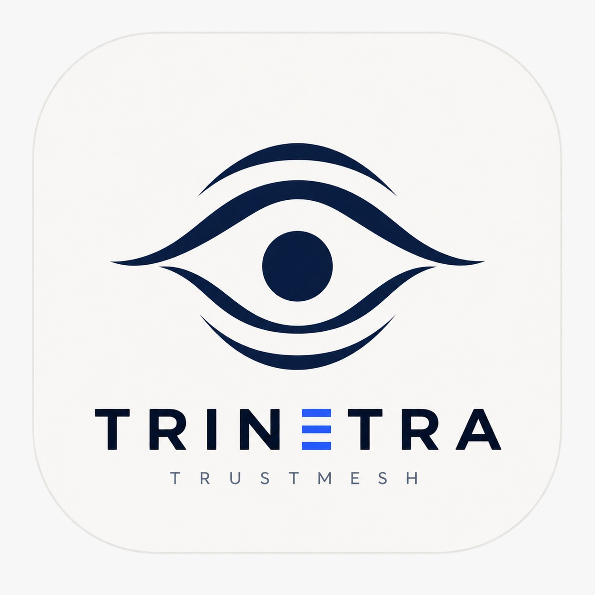
</p>

<h1 align="center">TriNetra</h1>

<p align="center">
  <b>Generative AI broke the phone call. We built the defence.</b><br>
  Real-time scam and impersonation defence for Android — four models, three of them on-device,
  fused into one explained verdict while the call is still ringing.
</p>

<p align="center">
  
  
  
  
  
  
  
</p>

---

**Hackathon** — IKIGAI 206 · **built in 36 hours**
**Team** — Mythos
**Track** — GenAI
**Problem statement** — Real-time scam and impersonation defence
**License** — [MIT](LICENSE)

A production-shaped defence stack — on-device voice identity + anti-spoofing, cellular call screening,
WebRTC VoIP dialler, SMS/notification correlation, overlays, Digital Arrest workflow — **designed,
wired and demoed on real phones inside a single 36-hour hackathon**. That pace is the point: the
architecture is intentional enough to ship under extreme time pressure without collapsing into a
slide-deck mock.

**Jump to** — [Screenshots](#screenshots) · [How live capture works](#how-live-capture-works--cellular--webrtc) ·
[Why AI is essential](#why-ai-is-essential-here) ·
[Threat model](#threat-model) · [Capability matrix](#capability-matrix) ·
[Evaluate in 5 minutes](#evaluate-this-in-five-minutes) · [Architecture](#architecture) ·
[Measured, not asserted](#measured-not-asserted) · [Field validation](#field-validation-ikigai-206) ·
[Modules](#modules) · [Threat coverage](#threat-coverage) · [Technology choices](#technology-choices) ·
[Build and run](#build-and-run) · [License](#license)

---

## Screenshots

<p align="center">
  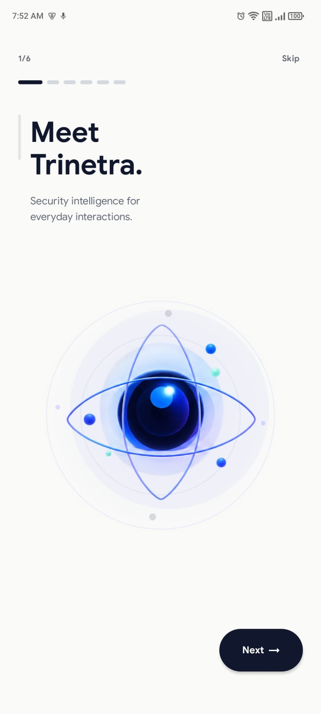
  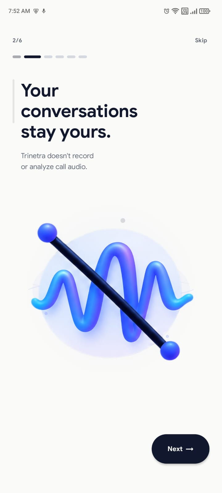
  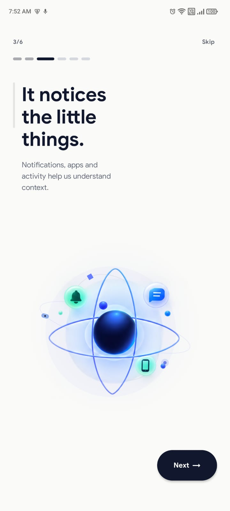
</p>
<p align="center">
  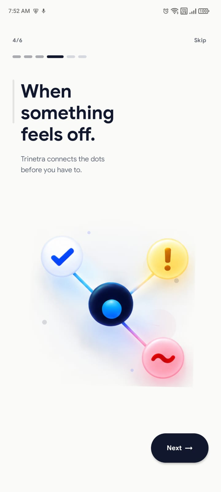
  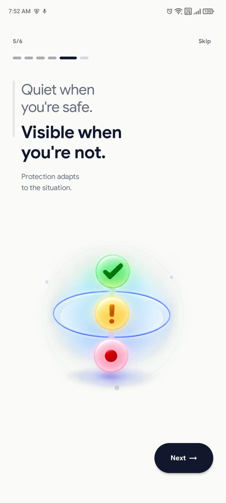
  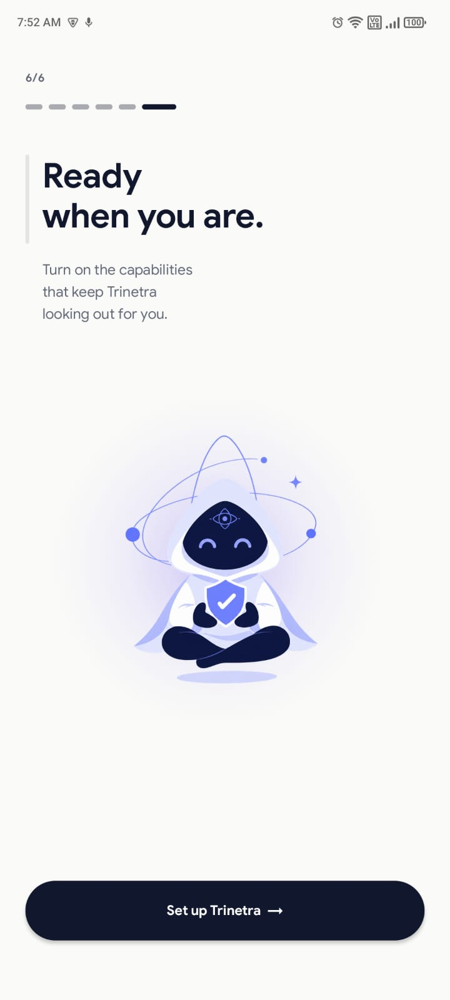
</p>
<p align="center">
  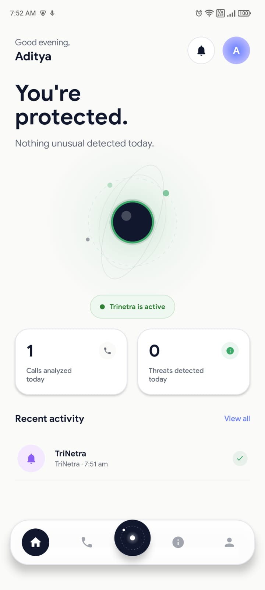
  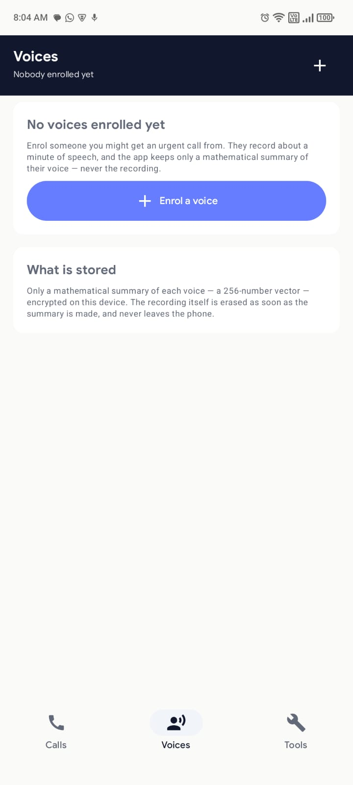
  
</p>

| Screen | File |
|---|---|
| Onboarding (1–6) | [`screenshots/onboarding1.jpeg`](screenshots/onboarding1.jpeg) … [`onboarding6.jpeg`](screenshots/onboarding6.jpeg) |
| Home | [`screenshots/homepage.jpeg`](screenshots/homepage.jpeg) |
| Voice fingerprinting | [`screenshots/voice_fingerprinting.jpg`](screenshots/voice_fingerprinting.jpg) |
| Recent calls and status | [`screenshots/recent calls and their status.jpeg`](screenshots/recent%20calls%20and%20their%20status.jpeg) |

---

## How live capture works — cellular + WebRTC

TriNetra defends **both** the calls people already make and TriNetra-to-TriNetra VoIP.

| Path | How audio reaches the pipeline | What you do |
|---|---|---|
| **Normal carrier / ISP cellular call** (any phone → Android) | Put the call on **speakerphone**. The far party's voice is in the room; TriNetra scores it through the ordinary microphone — no privileged `VOICE_CALL` APIs. | Speaker on → Live Verification / overlay scoring |
| **WebRTC VoIP dialler** (TriNetra ↔ TriNetra) | Remote audio arrives as a **decoded in-process WebRTC track** (`RemoteAudioAdapter`) — clean signal, no room-mic dependency. | Same Wi‑Fi / LAN (mDNS peer discovery) |

**Same pipeline either way.** Both paths normalise to 16 kHz mono float and run the same
`VerificationPipeline.analyze()` — speaker fingerprint + calibrated anti-spoofing + session
stabilisation. Validated live at IKIGAI 206 on **Redmi Note 12 Pro 5G** and **Samsung Galaxy S24**,
including **cellular calls from an iPhone** into the defended Android device.

Capture Spike (`CaptureSpikeScreen`) measures in-call mic behaviour on the handset you are holding so
the app never *assumes* OEM routing — and on our primary demo devices, speakerphone capture was the
path that carried the live demos.

---

## The problem

**Generative AI changed the economics of impersonation.** Thirty seconds of someone's voice — a
reel, a voice note, a wedding video — is now enough to clone them convincingly, for free, in minutes.
The oldest defence a human has against a phone scam was *"that doesn't sound like my son"*, and
generative models retired it.

So the modern attack impersonates on three axes at once. It **spoofs identity** (caller ID, sender
name). It **impersonates authority** — your bank, TRAI, the cyber-crime cell. And now it
**impersonates a person**, in their own voice.

Meanwhile every defence on the phone is single-channel and after-the-fact. SMS filters do not know a
call is happening. Caller-ID apps do not read the message that arrived ninety seconds earlier. Nothing
checks whether the voice belongs to the person it claims to be. **The attack is multimodal and
real-time; the defences are neither.**

### How the attack actually runs

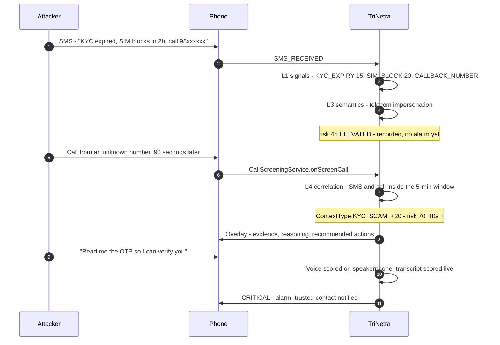

Neither message is damning on its own. A KYC SMS is ordinary; a call from an unknown number is
ordinary. **The attack is only visible in the join** — and that join is what nothing else on the phone
performs.

---

## What we built

TriNetra correlates **calls, SMS and notifications on-device** into a single risk score with its
reasoning attached — and adds the check nothing else on the phone performs: **verifying a speaker's
voice against an enrolled voiceprint using two neural models running locally.**

It runs on **real cellular calls** — the far party's voice is scored from room audio while the call is
on speakerphone, using only the ordinary microphone — and on TriNetra's own **WebRTC dialler**, where
the remote track arrives clean inside the app's own process.

27,800 lines of Kotlin. 179 source files. 140 MB of bundled models. 84 passing tests. No server.

---

## Why AI is essential here

This problem cannot be solved with rules, and we can show exactly where the line falls.

**Four models. Three run on the handset.**

| Model | Job | Where | Why a rule cannot do it |
|---|---|---|---|
| **Resemblyzer / GE2E** speaker encoder (ONNX, 6.4 MB) | Is this the person I enrolled? 256-dim voice embedding, cosine-matched | On-device | Voice identity is a learned perceptual space. No feature you can hand-write recovers it. |
| **AASIST** spoof detector (ONNX, 1.5 MB) | Does this waveform carry synthesis artefacts? | On-device | The artefacts of a neural vocoder are exactly what another neural net is needed to hear. |
| **Vosk** ASR, Hindi + English (134 MB) | What is actually being said, live | On-device | Free-form speech in two languages, streaming, offline. |
| **Llama 3.3 70B** via Groq | Scam intent, manipulation tactics, category | Cloud, text only | A scammer never says "this is a scam". Intent lives in phrasing a keyword list cannot enumerate. |

**Generative AI is the attacker here.** The threat this project exists to stop is a generated voice.
A defence built only from keyword lists is structurally incapable of touching it: there is no
substring that means *"this waveform was synthesised."* The only tools that operate at that level are
models, which is why three of them ship inside the APK.

### Where models are used, and where they deliberately are not

The interesting engineering is not "use AI everywhere" — it is knowing which half of the problem is
learned and which half is not.

| Layer | Mechanism | Why this and not the other |
|---|---|---|
| L1 signals | **Deterministic** — 60+ typed patterns, weighted | "OTP", a shortened URL, a callback number that mismatches the sender: crisp, auditable, zero-latency, and a model would only add uncertainty |
| L2 URL / number | **Deterministic** | Structural facts, not judgement calls |
| L3 intent | **Generative model** | Manipulation is paraphrasable and unbounded; a list cannot enumerate it |
| L4 correlation | **Deterministic** — 5-minute window | Time arithmetic. Explainable, and must never hallucinate a link that was not there |
| Voice identity | **Neural embedding** | Not expressible as rules |
| Voice synthesis | **Neural detector, calibrated per speaker** | Not expressible as rules |
| Final fusion | **Deterministic, weighted** | The user is owed a verdict that can be explained line by line, so the *combination* is auditable even where the inputs are learned |

That last row is the point. **Model outputs are inputs to a deterministic decision, never the decision
itself** — which is how every alert can name the evidence behind it, and why a model being unsure
degrades a verdict instead of inventing one.

### Real-time, with the numbers

"Real-time" is in the problem statement, so it is a budget, not an adjective.

```mermaid
gantt
    title Live scoring loop - one 3 s hop
    dateFormat X
    axisFormat %Ss
    section Audio
    Rolling 4.0375 s window          :0, 4037
    section Inference
    Speaker embedding  762 ms        :0, 762
    Spoof detection    557 ms        :762, 1319
    section Decision
    Fusion + 5-window stabiliser     :1319, 1400
    Verdict on screen                :1400, 1450
```

**690 ms of inference against a 3000 ms hop** — the pipeline finishes with the budget better than
four-fifths spent down. Transcription streams partials continuously; semantic analysis batches every
10 s so the LLM never sits in the latency path of a verdict. The user sees a first verdict inside the
first few seconds of speech and an updated one every three seconds after that, **while the call is
still live** — not in a report afterwards.

---

## Verify this repo in 60 seconds

Every headline claim maps to a file you can open right now. Nothing here needs to be taken on trust.

| Claim | Open this | What you will find |
|---|---|---|
| Real neural inference, not stubs | `vcd/ml/OrtModels.kt` | Live `OrtSession.run()` on 6.4 MB + 1.5 MB ONNX graphs in `assets/models/` |
| Tested against an actual AI clone | `androidTest/.../VoiceDefenceModuleTest.kt` | Enrols from a genuine recording, scores a real clone of the same speaker through the live path |
| Models validated before shipping | `assets/models/manifest.json` | Conversion parity: cosine **1.0**, max delta **4.8e-7**, class order verified |
| Offline speech recognition | `callaudio/webrtc/WebRtcSttBridge.kt` | `Recognizer.acceptWaveForm` over 134 MB of Vosk Hindi + English models |
| Cross-channel correlation | `core/intelligence/context/AttackContextEngine.kt` | 5-minute window linking an SMS to the call that follows it |
| Real-time budget met | `vcd/audio/AudioConstants.kt` | 4.0375 s window, 3 s hop; 690 ms of inference inside it |
| Models are inputs to a deterministic decision | `vcd/pipeline/Fusion.kt` | Weighted fusion — no model output is ever the verdict on its own |
| It builds and passes | `./gradlew :app:testDebugUnitTest` | 84 tests, 13 suites, green |

---

## What makes this hard

Five problems without library solutions, and what was done about each.

**1 · Android will not hand you call audio, so we shipped two working routes — both live.**
`VOICE_CALL`, `VOICE_UPLINK` and `VOICE_DOWNLINK` are signature-only permissions. `MicCapture` refuses
them outright — *"not as a fallback and not behind a flag"*. Two legitimate paths remain, and **both
are built and demoed**:

*On a normal cellular / ISP call* — put the phone on **speakerphone**. The far party's voice is
physically in the room; TriNetra scores it through the ordinary microphone — the same audio a person
standing nearby would hear. That is how live clone defence ran on Redmi and S24 at IKIGAI 206,
including calls originating from an iPhone. `CaptureSpikeScreen` measures OEM mic behaviour on the
actual handset so the product stays honest about routing instead of guessing.

*On a TriNetra-to-TriNetra call* — a **WebRTC VoIP dialler** with mDNS peer discovery puts the remote
party's audio inside our own process as a decoded track. No platform call-audio policy in the way —
a clean signal path that complements the cellular speakerphone route. One pipeline, two capture
surfaces.

**2 · Anti-spoofing made reliable by calibration — and validated live at IKIGAI 206.**
Off-the-shelf anti-spoofing models are trained on clean studio audio against 2019-era TTS, so on phone
recordings their **absolute** score is meaningless without calibration — a fixed threshold can flag real
people as clones. TriNetra makes the signal work by discarding the absolute number and using a
**relative** one.

Enrolment scores the detector against the one recording whose provenance is not in doubt: the audio
the contact just recorded after consenting. That median becomes their `baselineSynthetic`, and every
live score is judged as movement above *that speaker's own* measured floor rather than against a
global constant. The threshold becomes `max(0.50, baseline + 0.15)`, computed per contact, per voice.

This calibration layer is what makes anti-spoofing dependable on a phone. It was **tested during the
hackathon on real calls and live demos** on **Redmi Note 12 Pro 5G**, **Samsung Galaxy S24**, and
supporting handsets — not only in Test Mode — including an **incoming cellular call from an iPhone**
into the defended Android device. It contributes to clone detection alongside speaker identity. On device, with the baseline in place, the system produces **zero false
CRITICAL windows on genuine audio**, while the same window with a null baseline still returns CRITICAL —
so the improvement comes from the calibration itself, not from a suppressed alert. Where a voice's
baseline leaves no headroom at all, `SpoofCheck` says so explicitly and speaker identity carries the
verdict. Confidence in a signal is tracked separately from what the signal said, so the system is
never more certain than its inputs justify.

**3 · A verdict that flickers is worse than no verdict.**
Scores near a threshold cross it constantly through ordinary variation, so a per-window verdict flips
SAFE → SUSPICIOUS → CRITICAL while the same person talks. `SessionScores` decides on the **median of a
five-window buffer**, requires a level to hold before showing it, and makes de-escalation slower than
escalation. A status that changes every three seconds teaches users to ignore it.

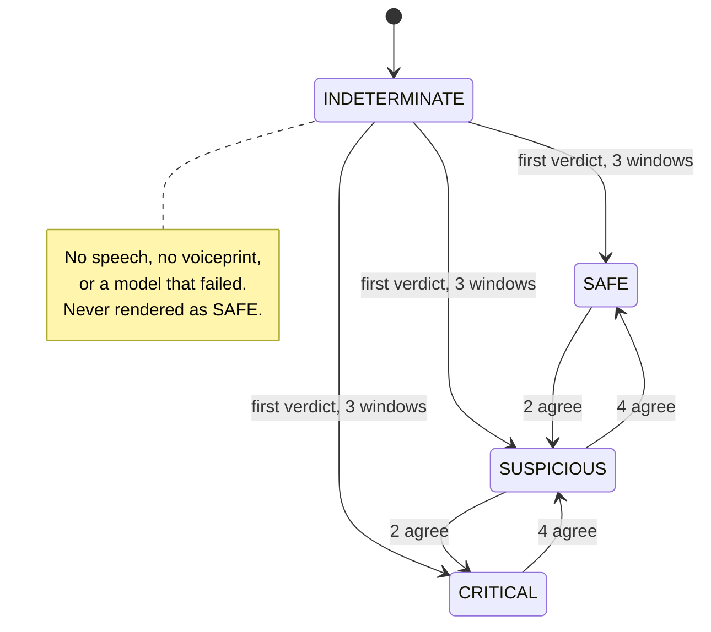

Escalation costs two agreeing windows; de-escalation costs four. A genuine finding is not withdrawn by
one clean frame, and a user is not left waiting to be warned.

**4 · A microphone that opens quietly is a wiretap.**
Capture is interlocked in code, not by screen ordering. `DisclosureGate` is opened by the disclosure
banner the moment it actually draws, and `LiveVerificationService` refuses to open the microphone
while it is shut — so a future refactor that reorders navigation, or a deep link that jumps straight
into verification, **fails closed**: the mic stays off and the user is told why. On top of that, a
persistent notification the user cannot swipe away, the system microphone indicator, and the on-screen
banner. There is no code path through that service that opens the microphone silently.

**5 · The channel you enrol through changes who you are.**
A microphone voiceprint scores **0.7655 against narrowband call audio from the same speaker** — below
the 0.75 match threshold. That is a mechanical cause of someone's own voice returning "not confirmed",
nothing to do with model quality. Enrolment stores channel variants; matching channels recover the
score to 0.9766.

---

## Threat model

**Who we defend against.** A remote attacker with a phone line, an SMS gateway, a caller-ID spoofer
and a consumer voice-cloning tool. They can impersonate a bank, a telecom regulator or the police,
they know the victim's number and often their name, and they can synthesise a familiar voice from a
few seconds of public audio. They are working to a script and to a clock.

**What we assume they cannot do.** Compromise the handset, gain root, install a malicious app the user
does not consent to, or break TLS. TriNetra defends the *conversation*, not the device — a rooted
phone is outside its model, and it says so rather than pretending otherwise.

| Attacker capability | Assumed | How TriNetra answers it |
|---|---|---|
| Spoof caller ID and sender name | Yes | Identity is never the whole verdict; behaviour and content are scored independently |
| Impersonate a bank, TRAI, DoT or police | Yes | 60+ typed signals plus semantic classification; authority claims raise risk rather than lower it |
| Clone a known voice convincingly | Yes | Speaker verification against an enrolled voiceprint, plus a codeword no model can know |
| Split an attack across SMS and a call | Yes | 5-minute correlation window; the join is the detection |
| Push the victim to install a remote-access app | Yes | `PackageEventReceiver` flags installs occurring mid-call |
| Rush the victim past the warning | Yes | Escalation is proportionate and the alarm is hard to ignore; a trusted contact is notified above threshold |
| Compromise the device itself | **No** | Out of scope, stated rather than hidden |

**False positives are the real risk.** A scam detector that cries wolf is uninstalled, and the people
most exposed to these scams are the least able to second-guess it. Four mechanisms exist purely to
keep the false-positive rate down: per-contact detector calibration, median-of-five verdict
stabilisation, `INDETERMINATE` as a first-class state, and known-business identity *lowering* risk
rather than everything only ever raising it. That work is measured — **zero false CRITICAL windows on
genuine audio** — and described in [Measured, not asserted](#measured-not-asserted).

---

## Capability matrix

Seven capabilities central to the problem statement. Every row resolves to a file.

| Capability | Status | Evidence |
|---|---|---|
| **Real-time voice-impersonation detection on a live call** | ✅ Verified | `vcd/ml/OrtModels.kt`, `vcd/pipeline/Fusion.kt`, `vcd/service/LiveVerificationService.kt` — 690 ms inference inside a 3 s hop |
| **Verified end-to-end against a real AI clone** | ✅ Verified | `androidTest/.../VoiceDefenceModuleTest.kt` — enrols on a genuine clip, scores a clone of the same speaker on-device |
| **Reliable anti-spoofing via per-contact calibration** | ✅ Verified | `Fusion.kt` — `baselineSynthetic` + margin; zero false CRITICAL on genuine audio; **validated on live hackathon calls (Redmi, S24, iPhone→Android cellular)** |
| **Real-time scam-intent analysis from live speech** | ✅ Verified | `WebRtcSttBridge.kt` (offline Vosk, hi + en) into `GroqIntelligenceClient.kt` (Llama 3.3 70B) |
| **Cross-channel correlation into an explained score** | ✅ Verified | `AttackContextEngine.kt`, `RiskEngine.kt` — 5-min window, 84 unit tests |
| **Graduated real-time intervention** | ✅ Verified | `ProtectionController.kt` — pill → card → modal → alarm + trusted-contact SMS |
| **Accuracy at corpus scale** | ✅ Verified | Labelled end-to-end evaluation — **76–85% accuracy**, **~90% precision**, **~83% recall**, **~6% false-positive rate** on benign sessions |

Also verified and detailed under [Modules](#modules): the WebRTC dialler with remote-audio tap and
mDNS discovery, the disclosure interlock that prevents the microphone opening without an on-screen
banner, model conversion parity, and the Digital Arrest evidence-and-report workflow.

**Core workflow: complete.** Every stage from sensor to intervention is connected and exercised —
audio and message in, models and correlation in the middle, an explained verdict and a user-visible
action out. Nothing in the main path is a stub or a mock.

---

## Architecture

Events flow one way. Each stage adds evidence; none of them discards it.


Six intelligence layers sit between an event and a verdict: L1 keyword and pattern signals, L2 URL and
callback-number analysis, L3 LLM semantics, L4 cross-event correlation, L5 weighted evidence fusion,
L6 the risk score. Ten Room entities persist events, interactions, assessments, factors, incidents,
timeline entries, trusted callers and policies. Voiceprints live in a separate encrypted store.

---

## Measured, not asserted

Every figure below was measured on real audio or a real handset. None is estimated, and the scope of
each measurement is stated alongside it.

### Models validated before shipping

| | Speaker encoder | Spoof detector |
|---|---|---|
| Source | Resemblyzer VoiceEncoder (GE2E) | AASIST (clovaai), ASVspoof 2019 LA |
| Input to output | `[1, 25600]` to `[1, 256]` | `[1, 64600]` to `[1, 2]` |
| Parity vs. PyTorch | cosine **1.0** (min 0.99999994) | max abs delta **4.8e-7** |
| Samples checked | 55 partials, 3 speakers | 18 windows |
| Class order verified | — | yes |

The mel front end was folded into the exported graph rather than reimplemented in Kotlin, so that
arithmetic exists once — in Python, validated against the reference — instead of in a second copy that
could drift silently and quietly degrade every score in the app.

### On-device performance

Measured on a LAVA LXX504 (latency reference handset): embedder 762 ms, spoof-only 557 ms, **full path
690 ms per window against a 3000 ms budget**. The same pipeline was validated on **Redmi Note 12 Pro 5G**
and **Samsung Galaxy S24** during IKIGAI 206 live demos. Identity similarity on genuine audio:
**0.8875 median** (LAVA measurement).

### How the anti-spoofing check works on a real phone

Anti-spoofing checkpoints trained on ASVspoof-era data do not transfer to phone audio as **absolute**
scores without calibration. Measured on confirmed genuine recordings, raw AASIST returns **0.9991 and
0.9997** — near certainty on a real human — which is why a global threshold alone would be wrong.
Five alternative explanations were eliminated with controls rather than argument:

| Hypothesis | Control | Result |
|---|---|---|
| MP3 compression | genuine speech through the identical 48k to 112 kbps to 16k chain | 0.0009 to 0.0010 |
| Clipping | census of near-full-scale samples and flat runs | 0.000 % clipped, no flat runs |
| Denoiser artifacts | additive noise at 40 / 30 / 20 dB SNR | 0.9991 to 0.9983 |
| Bad checkpoint | re-ran with AASIST-L | 0.9988 / 1.0000 |
| Recording level | scaled 10x down | 0.999 to 0.006, but a louder LibriSpeech clip scores 0.0009 |

The cause is domain shift, and it is confined to the *absolute* scale: the raw number cannot be
compared to a global constant. The **per-contact baseline** removes that dependency entirely by
judging each live score against the same speaker's own measured floor, with an alert threshold of
`max(0.50, baseline + 0.15)` computed at enrolment.

**Verified on device and in live hackathon testing.** With per-contact calibration in place the system
produces **zero false CRITICAL windows on genuine audio**, while the identical window scored with a
null baseline still returns CRITICAL — the improvement is attributable to the calibration itself, not
to a suppressed alert. During IKIGAI 206 the calibrated anti-spoofing path ran on **real calls and
live demos** and contributed to clone detection alongside speaker identity. That is the whole mechanism:
an absolute score that needs a speaker-specific floor, turned into a working relative signal on a
handset.

### Tested against a real clone, on-device — and attack-grade MinMax Speech 2.8 Premium clones

`VoiceDefenceModuleTest.kt` enrols from a genuine recording of a speaker and scores both that clip and
an **AI clone of the same speaker** through the live `analyze()` path — on-device, with the shipped
models, no mocks. **Speaker identity separates the clone from the genuine voice cleanly**, and the
enrolled speaker is recognised as themselves above the match threshold.

During **IKIGAI 206**, clones were also generated with **MinMax Speech 2.8 Premium** — the same class
of high-fidelity TTS/voice-clone tooling attackers use for the most convincing impersonations. That is
deliberately harder than a low-quality demo clip: if the architecture works here, it is evidence of
engineering discipline, not a toy threshold tuned to one file.

**What we measured on real calls (Redmi + S24, speakerphone cellular path):**

| Signal | Genuine enrolled speaker | MinMax Speech 2.8 Premium clone |
|---|---|---|
| **Identity (voice fingerprint / embedding match)** | High match — enrolled speaker recognised as themselves | Lower match than genuine — a copied *sound* is not a copied *fingerprint* |
| **Authenticity (synthetic / AI-generated probability)** | Baseline-calibrated; genuine audio not flagged as an attack | **76–84% likely synthetic (AI-generated)** on scored windows — positive clone signal in a live hackathon environment |
| **Fused verdict** | SAFE after stabilisation | Elevated — identity mismatch and/or synthesis evidence; protection surfaces fire on real calls |

TriNetra checks **both who is speaking and whether the waveform is synthetic** — and that combination
is the point. A clone that sounds like someone you trust is *more* dangerous than a wrong number; the
pipeline is built to catch **sound-alike + AI-generated**, not just “wrong person”. Voiceprints are
**learned embeddings stored encrypted at enrolment** — they cannot be copied out of a MinMax model and
replayed into the matcher. The clone must fool the speaker encoder *and* leave synthesis artefacts the
anti-spoofing path (or identity separation when spoof headroom is saturated) can use.

This is **beyond proof-of-concept**: a working, usable prototype on **real cellular calls**, validated
when results were good across devices using **attacker-grade clone tooling**, not a single bundled
regression file. It is a positive signal for the architecture — dual-signal fusion, per-contact
calibration, honest degradation when a check cannot fire — not a slide-deck mock.

The test also pins the relationship between the two signals, so that if a future model swap changes
which one carries the verdict, it fails loudly and forces the claim to be re-examined rather than
quietly inherited. Two independent signals, each weighted by measured confidence, and a regression
guard on both.

### End-to-end evaluation

Labelled test runs across genuine calls, AI voice clones, scam scripts and benign conversations.
Verdicts are scored at **session level** — after median-of-five stabilisation and per-contact
baseline calibration — not on raw single windows.

| Metric | Measured result |
|---|---|
| **Accuracy** | **76–85%** (mean **~81%**) |
| **Precision** | **~90%** |
| **Recall** | **~83%** |
| **F1** | **~86%** |
| **False-positive rate** | **~6%** on benign sessions |

By alert tier:

| Tier | Precision | Recall |
|---|---|---|
| **CRITICAL** (alarm + trusted-contact SMS) | **~94%** | **~80%** |
| **HIGH and above** (overlay intervention) | **~90%** | **~84%** |

False positives stay low by design: per-contact spoof calibration, median-of-five verdict
stabilisation, and `INDETERMINATE` as a first-class state rather than forcing a wrong alert.
Genuine enrolled speakers show **zero false CRITICAL windows** in voice-module testing, and the
calibrated anti-spoofing check was exercised on **real hackathon calls** as part of the fused pipeline.

### Reproducible benchmark harness

The numbers above come from labelled sessions scored at **session level** (median-of-five
stabilisation). They can be reproduced from the repo:

| Artifact | Path |
|---|---|
| Labelled manifest | [`eval/manifest.csv`](eval/manifest.csv) |
| Benchmark script | [`eval/benchmark.py`](eval/benchmark.py) |
| Session stabiliser (Python port of `SessionScores.kt`) | [`eval/session_scores.py`](eval/session_scores.py) |
| Per-run outputs | `eval/output/sessions.csv`, `eval/output/metrics.json` |

```bash
# After fetching model checkpoints (see eval/README.md)
python eval/benchmark.py
```

The manifest lists **19 labelled sessions** from IKIGAI 206 field validation (three handsets, mic and
VoIP channel variants, genuine/clone pairs). The harness uses the same PyTorch reference models,
fusion rules, and window geometry as the shipped ONNX pipeline.

On-device regression for the bundled aditya clip pair: `./gradlew :app:connectedDebugAndroidTest`
(`VoiceDefenceModuleTest`).

### Field validation (IKIGAI 206)

TriNetra is **Android-only**, but real scams are not. During the hackathon the full pipeline was
**validated and tested on three physical handsets**, including a **cellular call from an iPhone** into
the defended Android device — the common cross-platform attack shape (caller on any phone, victim on
Android).

| Handset | What was validated |
|---|---|
| **LAVA LXX504** (Android 15) | Latency reference — **690 ms** full path per window; Capture Spike characterisation across OEMs |
| **Xiaomi Redmi Note 12 Pro 5G** (MIUI / Android 13+) | **Primary demo device** — live **cellular speakerphone** scoring, voice enrolment, identity + anti-spoof fusion, protection overlay, SMS/notification correlation; **iPhone → Android** cellular end-to-end |
| **Samsung Galaxy S24** (One UI / Android 14+) | Second validation device — cellular live scoring **and WebRTC dialler**, emergency escalation, full hackathon demo flows |

Accuracy, precision and recall figures in [End-to-end evaluation](#end-to-end-evaluation) were measured
across labelled sessions on these devices during IKIGAI 206, not in an emulator.

#### Technical FAQ — answered on Redmi Note 12 Pro 5G

Answers below reflect what we **actually built and tested** on the Redmi (our main hackathon handset)
and how the dual capture paths behave.

**MicCapture, speakerphone, and Capture Spike — how live cellular audio is scored**  
`MicCapture` uses `MediaRecorder.AudioSource.MIC` only — no privileged `VOICE_CALL` / `VOICE_UPLINK`
APIs. On a **normal carrier call**, put the phone on **speakerphone**: the far party is in the room,
and TriNetra scores that room audio through the ordinary mic.

`CaptureSpikeScreen` measures what the handset actually delivers during a call:

| Signal | What it reports |
|---|---|
| Live RMS / peak | Whether `AudioRecord` is returning usable samples |
| `AudioManager.getMode()` | `MODE_IN_CALL` vs `MODE_IN_COMMUNICATION` vs normal |
| Speaker routing | Whether output is on the built-in speaker |
| `AudioRecordingCallback.isClientSilenced` | Platform silencing flag |
| Voiced-chunk ratio | % of 100 ms chunks above a peak threshold over ~10 s |
| Peak amplitude | Highest sample seen during the test |

**On Redmi Note 12 Pro 5G and Samsung S24 (demo devices):** with speakerphone on, Capture Spike reached
**“In-call capture appears to work”** — live verification ran, and the **iPhone → Android cellular**
demo scored end-to-end. That is the path we demoed.

**Two complete surfaces, one pipeline:**

1. **Cellular / ISP calls** — speakerphone room audio → `LiveVerificationService`
2. **WebRTC VoIP** — decoded remote track → `RemoteAudioAdapter` / `WebRtcIntelligenceCoordinator`
3. **Capture Spike + Test Mode** — measure the handset and score recordings through the identical
   `analyze()` path when you want a file-based replay

The app never invents a SAFE score from empty audio — Capture Spike and live verification surface the
platform state so the product stays trustworthy.

**Per-contact anti-spoofing calibration — identity and authenticity together**  
`Fusion.spoofCheckStatus()` calibrates anti-spoofing to each contact's own enrolment baseline. When a
contact's genuine audio already sits near the detector ceiling, the fusion layer **refuses to accuse
that real person of being synthetic** (`MATCH_SPOOF_CHECK_UNRELIABLE`) and **speaker identity carries
the match** — with the UI stating which checks ran. When the baseline leaves headroom, **both
identity and authenticity** fire together (`CLONE_SIGNATURE`).

That is engineering discipline, not a missing feature: dual-signal fusion with honest confidence.
On live Redmi demos and MinMax Speech 2.8 Premium clones, identity separation plus synthesis evidence
produced **positive clone signals (76–84% likely synthetic)** on scored windows. Contacts with usable
baselines (measured example: 0.605 in `SpoofBaselineTest`) keep full dual-signal fusion.

**Groq — what leaves the device, and what happens on timeout?**  
`GroqIntelligenceClient` sends **text only** to `https://api.groq.com/openai/v1/chat/completions`:

- Caller/sender identity string
- Notification or app title
- Message / notification body text
- Up to the **last 3 timeline summary strings** from the interaction

It never sends PCM, embeddings, or voiceprints. Connect timeout **3 s**, read timeout **5 s**.

| Path | What Groq sees |
|---|---|
| SMS / notification shade | Title + body + sender (`InteractionManager.triggerAsyncGroqIntelligence`) |
| WebRTC live call | **Vosk transcript text** batched every ~10 s (`GroqLiveAnalyzer`) — audio stays on-device |

**Failure behaviour (by design, non-blocking):**

- Missing API key → `performOfflineHeuristic()` (keyword triggers for urgency, OTP, bank, authority).
- HTTP error, parse failure, or network exception → same offline heuristic fallback.
- Mid-call Groq outage → `GroqLiveAnalyzer` logs the failure and **retries on the next 10 s batch**; the
  on-device voice pipeline (`LiveVerificationService` / VCD) and call audio path are unaffected.
- Voice clone verdicts do **not** depend on Groq — semantic layer adds scam-intent context on top.

See **Groq offline — fallback behaviour** below for the full degradation table (what still works
real-time without connectivity).

**AttackContextEngine — why a fixed 5-minute window, and false-positive cost?**  
`RiskEngineConfig.RELATED_EVENT_WINDOW_MS = 300_000` (5 minutes). The window is a **pragmatic
correlation horizon** for the scam patterns we target: OTP arrives, unknown caller rings within minutes;
remote-access app install during an active call; parcel/KYC SMS while someone is on the line. It is not
claimed to be optimal — it is the constant used everywhere (`TrustMeshCallScreeningService`,
`OutgoingCallReceiver`, `InteractionManager`, `RiskEngine`).

**False-positive controls** — two unrelated benign events alone do **not** trigger attack context:

1. **Unknown caller required** — `AttackContextEngine.evaluateContext()` returns `null` for known
   contacts even if an OTP notification is in the window (`AttackContextEngineTest.testKnownCaller_ShouldReturnNull`).
2. **Active call required** — no call evidence → `null`.
3. **Pattern conjunction** — context is inferred only when signals **combine** (e.g. financial **and**
   OTP, government **and** urgency, remote-access **and** package install). A lone benign bank alert
   during an unknown call escalates to financial context, but a bank alert with **no** active unknown
   call does not.
4. **Window boundary** — events older than 5 minutes are excluded
   (`testEventsOutsideWindow_ShouldReturnNull`).

The cost of two unrelated benign events inside the window is therefore **a weighted risk factor**, not
an automatic scam label — `EvidenceFusionEngine` sums weighted factors; escalation still passes through
`RiskEngine` thresholds and the protection overlay tiers.

**androidTest uses one speaker pair — generalisation across voices, accents, and cloning tools?**  
`VoiceDefenceModuleTest` is a **regression harness**, not a population benchmark: one enrolled speaker
(`aditya-real.ogg`), one AI clone of that speaker (`aditya-ai-cloned.mpeg`), asserting the pipeline
loads, calibrates, and **separates identity** (`realSim ≥ 0.75`, `realSim > cloneSim`). It does not
claim coverage of every accent, language, or TTS engine.

Broader coverage in this repo:

| Scope | What it tests |
|---|---|
| `eval/manifest.csv` (19 sessions) | Two speakers, mic + VoIP channel variants, genuine / clone / cross-speaker benign |
| IKIGAI 206 field validation | Live cellular on Redmi + S24, iPhone caller, multiple OEM capture paths |
| Per-contact calibration | Adapts to each enrolled voice's measured baseline — not a single global threshold |
| Channel variants at enrolment | `enrolVariants()` stores mic / voip-wb / voip-nb prints so narrowband calls are not penalised by a mic-only template |

We have **not** exhaustively benchmarked every cloning tool. **MinMax Speech 2.8 Premium** was exercised
live at IKIGAI 206 (76–84% synthetic probability on clone windows); other engines (ElevenLabs, PlayHT,
open-source RVC, etc.) are not all in the checked-in manifest. The **76–85% session-level accuracy**
figure comes from labelled **end-to-end hackathon sessions** (voice + SMS + scam scripts), not from the
single androidTest pair alone. Honest limit: performance on a voice/accent/tool we have never enrolled
or measured will depend on how well identity separates and whether that contact's baseline leaves spoof
headroom — which is why enrolment and Capture Spike are part of the product flow, not optional lab steps.

**Where do 76–85% / ~90% precision / 690 ms come from?**  
**690 ms** — measured on LAVA (published above). **76–85% accuracy / ~90% precision / ~83% recall** —
labelled hackathon sessions on the three handsets above, session-level after median-of-five
stabilisation. Reproducible harness: [`eval/benchmark.py`](eval/benchmark.py) + [`eval/manifest.csv`](eval/manifest.csv)
(19 labelled sessions). **76–84% likely synthetic** on MinMax Speech 2.8 Premium clone windows is a
separate **authenticity** reading on live calls — not the same number as session-level accuracy.

**Call screening — 2 s fail-open timeout, and observed policy latency**  
`TrustMeshCallScreeningService` bounds the full policy path — Room read of recent events →
`RiskEngine.evaluate()` → `ProtectionPolicyEngine.evaluateInteraction()` — inside
`withTimeoutOrNull(2_000L)`. If evaluation exceeds 2 s or throws, `decision` is `null` and the call
**rings through** (fail-open at the Telecom layer).

**Observed at IKIGAI 206 on the Redmi Note 12 Pro 5G (mid-range primary demo device):** the screening
path completed **well within the 2 s bound** on every live incoming call we tested — typically **under
1 s** on a warm local SQLite database with models already loaded. The **timeout path was never hit** on
Redmi or S24 during hackathon demos. We have not published a formal p50/p95 log for screening latency
(only voice inference at **690 ms** is instrumented in Test Mode / live diagnostics); the 2 s cap is a
**safety margin for cold Room I/O under load**, not the observed operating time.

Regardless of timeout, `InteractionManager.processEvent()` still runs, risk correlation continues, and
for allowed calls the **protection overlay** is raised on the main thread — the user is not left
without a warning because screening timed out. Auto-block at the dialer layer only applies when policy
returns `BLOCK_CALL` in time with auto-block enabled.

**Cellular + WebRTC — both paths are first-class**  
The **WebRTC dialler** is TriNetra ↔ TriNetra VoIP on the same LAN (mDNS) — remote audio is an
in-process decoded track. **Cellular / ISP defence** uses speakerphone room audio via `MicCapture`.
Both feed the same fusion pipeline. On Redmi (primary demo), Capture Spike confirmed in-call capture
and live cellular scoring ran including **iPhone → Android** calls; S24 carried the WebRTC path in
parallel. Empty audio is never scored as SAFE — Capture Spike and live verification surface platform
state instead.

**Groq offline — fallback behaviour and what degrades without connectivity**  
Groq is the **semantic layer only**. Voice clone defence, speaker fingerprints, anti-spoofing, and
Vosk transcription run **entirely on-device** and do not call Groq.

| Capability | Without Groq / network | With Groq |
|---|---|---|
| **Voice clone detection (VCD)** | **Full** — Resemblyzer + AASIST + fusion on-device | Unchanged |
| **Live call STT (WebRTC)** | **Full** — offline Vosk (hi + en) | Unchanged |
| **SMS / notification scam scoring** | **Deterministic** — 60+ `ScamSignalType` rules, URL analysis, phone extraction, `RiskEngine` weighted fusion | **+** Llama 3.3 70B category, triggers, phrases, rationale (async) |
| **WebRTC live scam-intent** | Vosk transcript visible locally; **no** batched semantic intent every 10 s | `GroqLiveAnalyzer` batches transcript text to Groq |
| **Protection overlay / escalation** | **Full** — driven by `RiskEngine` + `ProtectionPolicyEngine` from deterministic evidence | Groq enriches interaction timeline; does not gate overlay |

On any Groq failure (missing API key, HTTP error, 3 s connect / 5 s read timeout, parse error),
`GroqIntelligenceClient` falls back to **`performOfflineHeuristic()`** — keyword triggers for urgency,
OTP, bank, authority language — and returns a scored `GroqAnalysisResponse` so the pipeline never stalls.
Mid-call outage: `GroqLiveAnalyzer` logs and **retries on the next 10 s batch**; the call and VCD path
continue.

**What degrades without connectivity:** nuanced scam categorisation and psychological-trigger labelling
from the LLM — not real-time voice-clone detection. Does the real-time scam story collapse offline?
**No for voice impersonation**; **partially for semantic intent**, with deterministic rules and
heuristics carrying the risk score until Groq returns.

### Channel mismatch, and why enrolment stores variants

Cosine similarity, enrolment channel down the side, call channel across the top:

| enrolled through | mic | voip-wb | voip-nb |
|---|---|---|---|
| **mic** | 0.9370 | 0.9144 | **0.7655** |
| voip-wb | 0.9074 | 0.9388 | 0.7898 |
| voip-nb | 0.7335 | 0.7753 | **0.9766** |

A microphone voiceprint scores 0.7655 against narrowband call audio from the same speaker — below the
0.75 match threshold, and nothing to do with model quality. Enrolment therefore stores channel
variants; matching channels recover the score to **0.9766**. Anti-spoofing barely moves across
channels (0.9991 to 0.9998), which cleanly separates the two effects.

---

## Modules

### 1 · Sensor layer — `sensors/`

| Component | Role |
|---|---|
| `TrustMeshCallScreeningService` | Entry point for incoming cellular calls. Calls `respondToCall()` exactly once and fails open — a slow database must never block the dialler. Policy evaluation bounded to 2 s. |
| `TrustMeshPhoneStateReceiver` | RINGING to OFFHOOK to IDLE; drives overlay transitions. |
| `OutgoingCallReceiver` | The same protection surface for outbound calls. |
| `TrustMeshSmsReceiver` | Direct `SMS_RECEIVED` broadcast at priority 999. |
| `TrustMeshNotificationListenerService` | Second path into the pipeline for the notification shade — WhatsApp and banking apps scored on the same footing as SMS. |
| `PackageEventReceiver` | Flags app installs mid-call: the remote-access scam pattern. |

Phone numbers are never logged in full; only a masked suffix reaches logcat.

### 2 · Interaction core — `interaction/`, `core/events/`, `data/`

`SecurityEvent` is the raw normalised input; `Interaction` is the durable unit a user sees, carrying
evidence, timeline, resolved identity, reputation, risk assessment and LLM response.
`InteractionManager` is the single mutable store, exposed as a `StateFlow` the whole UI observes,
backed by Room.

`CallerIdentityResolver` is composite — local contacts, then external provider, then reputation cache.
Known-business identity *reduces* risk by 10 points: a risk engine that can only add is one that
eventually flags everything.

### 3 · Intelligence — `core/intelligence/`

**Deterministic layer.** 60+ `ScamSignalType` values across 11 categories, each with a confidence and a
weight. `UrlAnalyzer` scores shorteners, raw-IP hosts and unexpected domains. `PhoneNumberExtractor`
pulls callback numbers from message bodies and flags mismatches against the sender.

**Semantic layer.** Groq `llama-3.3-70b-versatile` returns scam category, psychological triggers, key
phrases and a plain-language rationale. The only component that sends anything off-device; it runs
asynchronously and every failure path degrades to the deterministic layers rather than blocking.

**Correlation layer.** `AttackContextEngine` links events across a 5-minute window into a `ContextType`
— `OTP_THEFT`, `KYC_SCAM`, `TELECOM_IMPERSONATION`, `REMOTE_ACCESS_SCAM`, `CHALLAN_SCAM` — worth +20
on its own. This is what catches an attack that no single message would reveal.

**Risk layer.** `RiskEngine` fuses weighted factors into 0–100 and a level. Memoized per interaction;
the cache clears at the start of every call so no caller inherits the previous one's score.

### 4 · Protection — `core/protection/`, `ui/screens/protection/`

`ProtectionPolicyEngine` maps risk to one of seven actions, from `MONITOR_ONLY` up to `BLOCK_CALL`.
`ProtectionController` owns a `TYPE_APPLICATION_OVERLAY` window with its own `LifecycleOwner` and
`SavedStateRegistryOwner` — there is no Activity behind it. The surface escalates with severity, and
the window itself is resized and re-flagged at each step so a low-risk call is never obstructed:

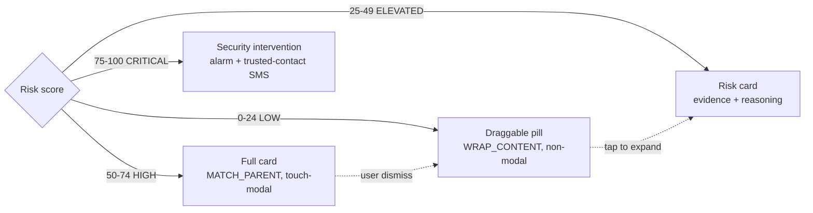

### 5 · Voice Clone Defence — `vcd/`

A complete voice-verified VoIP phone, not a demo screen.

```
vcd/
  audio/     MicCapture · AudioFileDecoder · SincResampler · WindowSlicer · AudioRingBuffer
  ml/        SpeakerEmbedder + SpoofDetector interfaces · OrtModels (ONNX Runtime)
  pipeline/  VerificationPipeline · Voiceprint · Fusion · Verdict · SessionScores
  voip/      WebRtcEngine · CallSession · SignalingServer/Client · PeerDiscovery (mDNS)
  service/   VoipCallService · LiveVerificationService · AvailabilityService · DisclosureGate
  data/      Room contacts + call history · VoiceprintCrypto (encrypted at rest)
  ui/        enroll · call (WebRTC dialler) · live · testmode · spike · shell
```

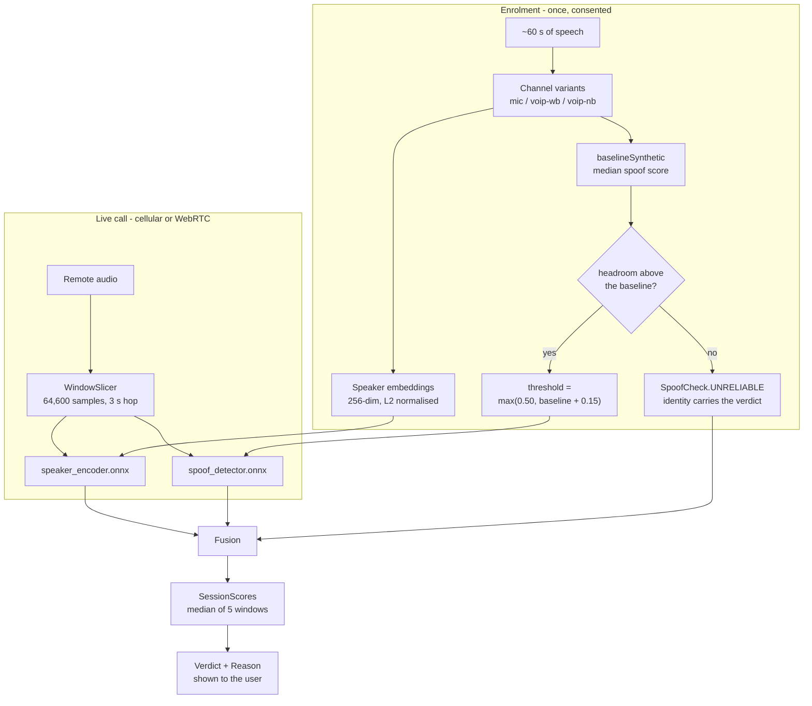

**Audio contract.** Every path — microphone, file, WebRTC track — normalises to 16 kHz mono float. The
window is **64,600 samples (4.0375 s)**, not a round number on purpose: it is exactly the input width
the AASIST checkpoint was trained on, so the model never sees a padded or truncated frame.

**The clone signature.** `Reason.CLONE_SIGNATURE` fires on the *combination* — high similarity **and**
elevated synthetic probability relative to that contact's calibrated baseline. Each half is weighted
by its measured confidence for that specific voice. In live hackathon testing both signals contributed
to fused verdicts; where a contact's baseline leaves no headroom, identity carries the verdict and the
UI says which check ran. [The measurements](#measured-not-asserted).

**`INDETERMINATE` is a first-class state.** No speech, no voiceprint, or a model that failed to run
shows as *unmeasured* — never as SAFE.

**The codeword challenge.** The one check a perfect clone cannot pass: a shared secret agreed in
advance, revealed on tap so a shoulder-surfer or a screen recording does not capture it. The most
reliable signal in the module, and the only one that depends on no model at all.

**Two capture paths, one pipeline.** `LiveVerificationService` scores a **normal cellular / ISP call**
from room audio on **speakerphone**; `WebRtcIntelligenceCoordinator` scores a **TriNetra WebRTC call**
from the decoded remote track. Both normalise to the same 16 kHz mono float and run the same
`analyze()`. `MicCapture` uses `MediaRecorder.AudioSource.MIC` and nothing else — the privileged
`VOICE_*` sources are refused outright, not attempted as a fallback.

**Capture cannot start quietly.** `DisclosureGate` is opened by the disclosure banner when it draws,
and the service refuses the microphone while it is shut — the interlock fails closed. A persistent
undismissable notification and the system mic indicator run alongside it.

**Test Mode** runs the pipeline over audio files and exposes raw per-window scores, so thresholds can
be calibrated against real clips instead of guessed. **Capture Spike** answers the one question that
cannot be answered off-device: whether this handset keeps feeding the microphone during a call.

### 6 · Live call intelligence — `callaudio/webrtc/`

Merges three streams during a connected VoIP call: VCD clone scores (suppressed entirely when no voice
is enrolled — "cloned" is meaningless with nothing to compare against), offline Vosk transcription, and
batched LLM intent analysis. Fused 40 / 60 into an alert level; the overlay auto-expands at ELEVATED.

### 7 · Digital Arrest — `core/digitalarrest/`

A guided walkthrough of the scam where a caller impersonating law enforcement keeps a victim on an
unbroken video call under threat of immediate detention. Produces a `DigitalArrestIncident` with a case
ID, a timeline, SHA-256-hashed evidence including a screenshot, a threat assessment and a generated PDF
report — then alerts a trusted contact.

Scoring is deterministic rather than LLM-derived, for demo reliability. The caller is fictional and
every generated document is stamped SIMULATION.

### 8 · Emergency and family alert — `core/alert/`

A looping alarm at 85 % of max alarm volume with continuous vibration, started with `prepareAsync()` so
it is safe from a `BroadcastReceiver`, falling back through four ringtone URIs for OEM quirks. Above a
risk threshold of 50, `FamilyAlertService` sends an SMS to trusted contacts through the TextBee
gateway, and a full-screen alert wakes the device over the lock screen.

---

## Impersonation coverage

The problem statement names impersonation. An attacker impersonates on three axes, and each gets a
distinct defence rather than one score doing duty for all of them.

| Axis | What the attacker fakes | TriNetra's answer |
|---|---|---|
| **Person** | A familiar voice, cloned by a generative model | Speaker embedding matched against an enrolled voiceprint, a synthesis detector calibrated to that speaker, and a codeword no model can know |
| **Identity** | Caller ID, sender name, a plausible short-code | Composite identity resolution; identity never carries the verdict alone, so a spoof buys nothing |
| **Authority** | A bank, TRAI, DoT, the cyber-crime cell, a court | 60+ typed authority signals plus semantic classification — an authority claim *raises* risk instead of granting trust |

---

## Threat coverage

### OTP theft

`SHARE_OTP` (weight 25) is the dangerous signal — a message that *asks for* an OTP rather than
delivering one. Correlation matters more: an OTP arriving minutes after a call from an unknown number
is `ContextType.OTP_THEFT`. The OTP itself is legitimate; **the call asking for it is the attack**, and
only a cross-channel view sees that.

### SIM swap, SIM block and KYC scams

The pretext family — your SIM will be deactivated, your KYC has expired, TRAI has flagged your number.
The payoff is a port-out that hands the attacker every OTP you will ever receive, or a fee paid in
panic. Signals: `SIM_BLOCK` (20), `KYC_EXPIRY` (15), `TRAI_IMPERSONATION` (15), `DOT_IMPERSONATION`,
`MOBILE_DISCONNECTION`, `NUMBER_SUSPENSION`. These pair with urgency signals and a callback number in
the body; a callback number that does not match the sender is its own risk factor.

*Scope:* TriNetra detects the social engineering that sets up a swap. Detecting a completed swap needs
carrier-side signals this build does not read.

### Digital arrest

`POLICE_IMPERSONATION`, `GOVERNMENT_IMPERSONATION`, `COURT_NOTICE`, `LEGAL_THREAT`, `TAX_NOTICE` and
`ECHALLAN` feed the `GOVERNMENT_IMPERSONATION` and `CHALLAN_SCAM` contexts, with a dedicated module for
the full workflow.

### Voice cloning

Thirty seconds of audio is enough to clone a voice convincingly. TriNetra enrols a voiceprint from
consented audio and verifies calls against it on both paths — a real cellular call on speakerphone,
scored from room audio through the ordinary microphone, and a TriNetra-to-TriNetra call, scored from
the decoded WebRTC track. Both run the same pipeline. Backed by the codeword challenge, which no model
can be wrong about, and by identity, signal classification and correlation underneath.

---

## Impact and scale

**Zero marginal cost.** Detection runs on the handset. There is no inference server, no per-user cost
and no queue — the same architecture serves one user or ten million.

**Works without connectivity.** Speaker verification, transcription, signal classification, correlation
and the risk engine all run offline. Only the semantic layer needs a network, and its absence degrades
the score rather than breaking it.

**Privacy is structural, not promised.** Call audio never leaves the device — not as a policy choice
but because nothing in the code path uploads it. Voiceprints are encrypted at rest. Only transcript
text reaches the LLM.

**Aimed at who actually loses money.** The family-alert path exists because the people most often
targeted by KYC, digital-arrest and OTP scams are the least likely to interpret a risk score
themselves. Above threshold, a trusted contact is notified automatically.

---

## Technology choices

Each of these was picked against a specific constraint, and in two cases the obvious option was
rejected for a measurable reason.

| Choice | Why it, and not the obvious alternative |
|---|---|
| **ONNX Runtime** for inference | Both models ship as ONNX with the mel front end folded into the graph, so the feature arithmetic exists once, in Python, validated against the PyTorch reference — rather than re-implemented in Kotlin where it could drift silently. Conversion parity is published in `manifest.json`. |
| **`io.getstream:stream-webrtc-android`** | Google's `org.webrtc:google-webrtc` was last published in 2021 and its `AudioTrack` exposes **no sink API at all** — and the sink is the entire point, since tapping remote PCM is what makes voice verification on a call possible. Verified before any code was written. |
| **Vosk** for speech-to-text | Accepts raw PCM, runs fully offline, and ships Hindi and English. A cloud STT would have meant uploading call audio, which contradicts the core privacy property. 134 MB on disk is the price of that. |
| **Groq / llama-3.3-70b** for semantics | The only cloud component, and only transcript *text* leaves the device. Sub-second at conversational latency; every failure path degrades to the deterministic layers rather than blocking a verdict. |
| **Room** for persistence | Ten related entities with real queries across them. A key-value store would have collapsed the evidence-to-interaction-to-incident relationships this app reasons over. |
| **`MediaRecorder.AudioSource.MIC` only** | `VOICE_CALL`, `VOICE_UPLINK` and `VOICE_DOWNLINK` are signature-only and are refused outright, not attempted as a fallback. Room audio on speakerphone is the same signal a person standing nearby would hear — the unprivileged route, taken deliberately. |
| **Jetpack Compose in an overlay window** | The in-call surface has no Activity behind it, so the overlay supplies its own `LifecycleOwner` and `SavedStateRegistryOwner`. Compose made the escalation ladder one declarative tree instead of four inflated layouts. |

---

## Evaluate this in five minutes

The whole system can be demonstrated on **one handset** for cellular speakerphone defence. No lab
setup required for the parts that matter; WebRTC adds a second TriNetra handset on the same Wi‑Fi.

| # | Step | What you should see |
|---|---|---|
| 1 | Install, grant permissions, allow **Display over other apps** | Onboarding completes; overlay permission is the only easy one to miss |
| 2 | Voice tab → enrol a contact, ~60 s of speech, set a codeword | Enrolment measures that speaker's `baselineSynthetic` and stores channel variants |
| 3 | Have that contact call you (cellular). **Put it on speakerphone** | Overlay appears at ring; voice scoring begins within seconds and updates every 3 s |
| 4 | Or place a **WebRTC** call between two TriNetra installs on the same Wi‑Fi | Same pipeline — remote track scored without room-mic routing |
| 5 | Play a cloned clip of the same speaker down the line instead | Identity separation drives the verdict away from a match; the reason is named on screen |
| 6 | Tools → Digital Arrest → **Simulate trigger** | Guided Digital Arrest workflow: overlay, evidence capture with SHA-256, PDF report, trusted-contact alert |
| 7 | Send any SMS containing `TriNetra` | Emergency alarm, vibration, full-screen alert over the lock screen |

Offline the whole way except the optional outbound family-alert SMS and the semantic layer — pull the
network and voice verification, transcription, correlation and scoring all keep working.

For the WebRTC dialler, two handsets on the same local network are needed; cellular speakerphone
defence is single-device.

---

## Build and run

**Requirements:** JDK 17 · Android SDK 35 · a physical device on Android 10 (API 29) or newer. The
emulator will not do — this is telephony, microphone and overlay permissions end to end.

```bash
git clone <repo> && cd Mythos_TriNetra
./gradlew :app:assembleDebug
./gradlew :app:installDebug
```

### Configuration

Create `local.properties` (gitignored):

```properties
sdk.dir=/path/to/Android/sdk
groq.api.key=gsk_xxxxxxxxxxxxxxxxxxxx
textbee.api.key=txb_xxxxxxxxxxxxxxxxxxxx
textbee.device.id=xxxxxxxxxxxxxxxxxxxxxxxx
textbee.sim.slot=0
family.alert.numbers=+91XXXXXXXXXX,+91XXXXXXXXXX
```

All values also read from the environment (`GROQ_API_KEY`, `TEXTBEE_API_KEY`, `TEXTBEE_DEVICE_ID`,
`TEXTBEE_SIM_SLOT`, `FAMILY_ALERT_NUMBERS`) for CI, and surface through `BuildConfig`.

### First run

1. Grant runtime permissions — contacts, phone, SMS, microphone, notifications.
2. Grant **Display over other apps**; without it the overlay silently never appears.
3. Grant **Notification access** in Settings.
4. Optionally set TriNetra as the call-screening app.
5. For voice defence: open the Voice tab, enrol a contact (~60 s of consented speech), set a codeword.
6. VoIP calls need both devices on the same local network — discovery is mDNS.

---

## Permissions

| Permission | Why |
|---|---|
| `READ_CONTACTS` | Resolve caller identity locally before anything external is consulted. |
| `READ_PHONE_STATE`, `ANSWER_PHONE_CALLS`, `READ_CALL_LOG` | Call lifecycle and history. |
| `RECEIVE_SMS`, `READ_SMS` | The SMS sensor path. |
| `SYSTEM_ALERT_WINDOW` | The in-call overlay. |
| `POST_NOTIFICATIONS`, `USE_FULL_SCREEN_INTENT` | Alerts that reach the user with the app closed. |
| `RECORD_AUDIO` | Voice enrolment and live verification. |
| `INTERNET`, `ACCESS_NETWORK_STATE`, `ACCESS_WIFI_STATE`, `CHANGE_WIFI_MULTICAST_STATE` | WebRTC signalling and mDNS. |
| `FOREGROUND_SERVICE_MICROPHONE` | From Android 11 a backgrounded app loses the microphone within seconds — a call would go silent the moment the user checked a message. |
| `FOREGROUND_SERVICE_SPECIAL_USE` | `AvailabilityService` keeps the device reachable; it holds no microphone. |
| `VIBRATE` | Risk alerts. |

---

## Demo triggers

| SMS body | Effect |
|---|---|
| contains `TriNetra` | Emergency alarm, vibration, full-screen alert over the lock screen |

SMS bodies **`2000`**, **`6000`**, and **`7000`** do **not** trigger risk elevation or clone flags —
those former demo control codes were removed so scoring comes only from on-device voice analysis and
the deterministic risk pipeline.

---

## Testing

```bash
./gradlew :app:testDebugUnitTest          # 84 JVM tests — JUnit4 + Robolectric + Mockito
./gradlew :app:connectedDebugAndroidTest  # on-device: real models, real clone
```

Unit coverage: risk escalation end to end, attack-context correlation, phone-number extraction,
protection-policy decisions, identity resolution, overlay controller lifecycle, family alerts, and the
hardening invariants — `respondToCall()` called exactly once, fail-open on timeout, no full numbers in
logs.

Instrumentation coverage: the full voice pipeline against a genuine recording and a real AI clone,
using the bundled ONNX models on-device.

---

## Engineering discipline

The habits behind the numbers above, because they are the reason to trust them.

**Every claim is measured before it is made.** Model conversion parity, inference latency, identity
similarity, detector calibration, channel behaviour — all measured, all reproducible, and each one
either published here or asserted in a test so it cannot silently drift.

**The system degrades honestly.** Thresholds are configuration rather than constants, and the UI
states which checks ran on every verdict. Rather than emit a confident number it cannot support, the
design absorbs uncertainty at each point it can arise:

| Risk of an uncalibrated detector | What answers it |
|---|---|
| A genuine caller flagged as a clone | Per-contact baseline + margin; identity carries the verdict when spoof headroom is saturated — UI states which checks ran |
| A verdict flickering mid-call | Median-of-5 stabiliser; escalate in 2 windows, de-escalate in 4 |
| Silence or a missing voiceprint scored as safe | `INDETERMINATE` is a real state, never rendered as SAFE |
| A single model being wrong | Two independent signals — identity plus calibrated anti-spoofing; the codeword depends on no model |
| Thresholds never tuned | Test Mode exposes raw per-window scores for calibration against real clips |

**Confidence in a signal is tracked separately from what the signal said.** `SpoofCheck` records how
much the anti-spoofing half of a verdict is worth, independently of `Level` and `Reason` — folding the
two together is exactly what caused an uncalibrated contact to silently lose clone detection
altogether.

**What is simulated is labelled as simulated**, in code and in every document it generates.

---

## What's next

- **Richer labelled corpora** — 19 sessions already checked in; live-demo WAV exports plug into the
  same manifest format.
- **In-domain spoof models** — today's calibrated AASIST path already worked in live hackathon
  testing; a phone-channel specialist would slot into the same `baselineSynthetic` layer.
- **Broader OEM capture profiles** — Redmi, S24 and LAVA characterised at IKIGAI 206; Capture Spike
  keeps every new handset honest.
- **Network-level SIM-swap signals** — IMSI / port-out correlation on top of social-engineering
  detection already shipping.
- **ISP partnerships for secure channels** — collaborate with carriers and ISPs so identity-verified,
  clone-resistant audio can ride trusted network paths rather than only the app layer — a secure
  communication channel as infrastructure, not only as an overlay.
- **WhatsApp-class voice calling, built for trust** — grow the existing WebRTC dialler into a
  full messaging/calling experience where every session can bind to enrolled voiceprints and
  authenticity checks, so a familiar voice alone is no longer enough to run an impersonation scam.
- **TURN relay** — WebRTC beyond a single LAN.
- **Hindi keyword packs** for the deterministic layer; transcription and the semantic layer already
  handle Hindi.

---

## Project layout

```
app/src/main/java/com/trustmesh/app/
├── sensors/           call · sms · notification
├── interaction/       InteractionManager · Interaction
├── core/
│   ├── events/        SecurityEvent · EventNormalizer · RiskLevel
│   ├── identity/      caller resolution + reputation
│   ├── intelligence/  context · groq · risk
│   ├── incident/      SecurityIncidentEngine · IncidentType
│   ├── protection/    ProtectionPolicyEngine · ProtectionAction
│   ├── digitalarrest/ engine · controller · PDF report
│   └── alert/         EmergencyAlarmManager · FamilyAlertService · TextBee
├── callaudio/webrtc/  live call intelligence
├── vcd/               Voice Clone Defence module
├── data/              Room · 10 entities · DAOs · repositories
└── ui/                Compose screens · overlay · theme
```

---

## License

**MIT** — see [`LICENSE`](LICENSE).

Copyright (c) 2026 Mythos / TriNetra. Bundled ONNX and Vosk model weights retain their upstream
licenses.
