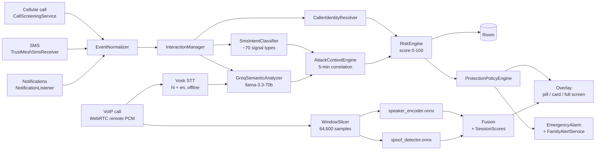

<p align="center">
  
</p>

<h1 align="center">TriNetra</h1>

<p align="center"><b>On-device scam defence for Android</b></p>

---

**Track** — Cybersecurity, Digital Trust and Smart Surveillance

**Problem** — Indian phone users lose money daily to scams that arrive as an ordinary call or SMS: a
"your KYC has expired, your SIM will be blocked" message, a caller posing as a police officer
demanding an immediate fine, a request to read out an OTP — and now a familiar voice on the line that
was generated by a model. Each channel is defended separately, if at all, so an attack that starts as
an SMS and finishes as a phone call slips between the gaps.

**Solution** — TriNetra correlates those channels on-device into a single explained risk score, and
adds the check none of them have: verifying that the voice on a call belongs to the person it claims
to be.

---

TriNetra watches the signals a phone already receives — who is calling, what arrives by SMS, what
other apps put in the notification shade, and (on its own VoIP calls) the voice on the line — and
fuses them into one risk score with an explanation attached.

The name is the project's thesis: three eyes on the same conversation. Signal (who is calling),
semantics (what they are saying), and voice (whether the speaker is who they claim to be). No single
one of those is reliable alone; a scam that defeats all three at once is much harder to build.

> **Status: research prototype / demo build.** Detection thresholds ship uncalibrated on purpose, the
> Digital Arrest walkthrough is a deterministic simulation, and the app makes no accuracy claims. See
> [Honesty about what is real](#honesty-about-what-is-real) — it is not an appendix, it is the part
> that matters most if you are evaluating this.

---

## Table of contents

- [What it does](#what-it-does)
- [Capability check](#capability-check)
- [Architecture](#architecture)
- [Modules](#modules)
- [Threat coverage](#threat-coverage)
- [Build and run](#build-and-run)
- [Permissions](#permissions)
- [Demo triggers](#demo-triggers)
- [Testing](#testing)
- [Model verification](#model-verification)
- [Honesty about what is real](#honesty-about-what-is-real)
- [Known gaps](#known-gaps)
- [Project layout](#project-layout)

---

## What it does

| Surface | What TriNetra does |
|---|---|
| **Incoming cellular call** | Screens via `CallScreeningService`, resolves caller identity and reputation, scores risk, and raises a floating overlay that grows with severity — pill, then risk card, then full-screen intervention. Can block on policy. |
| **SMS** | Parses every message for ~70 scam signal types (OTP requests, KYC/SIM threats, parcel and challan scams, payment links, urgency and authority language), and extracts callback numbers and URLs. |
| **Notifications** | Reads the notification shade through `NotificationListenerService`, so messages from WhatsApp, banking apps and the rest are scored on the same footing as SMS. |
| **Correlation** | Notices that a "your SIM will be blocked" SMS and a call from an unknown number ninety seconds later are one attack, not two events. |
| **VoIP call (TriNetra-to-TriNetra)** | Runs speaker verification and anti-spoofing on the remote audio, on-device, plus live Hindi/English transcription and LLM scam-intent analysis. |
| **Escalation** | Vibrates, raises a full-screen alert, and can SMS a trusted contact when risk crosses threshold. |

Everything except the LLM semantic layer runs on the device. Call audio never leaves the phone.

---

## Capability check

Every row below is verifiable from source in under a minute. Status is honest, including the last one.

| Capability | Status | Evidence |
|---|---|---|
| Speaker verification + anti-spoofing, on-device | Verified | `vcd/ml/OrtModels.kt` (real `OrtSession.run`), `assets/models/speaker_encoder.onnx` 6.4 MB, `spoof_detector.onnx` 1.5 MB |
| Clone verdict fusion and stabilisation | Verified | `vcd/pipeline/Fusion.kt`, `vcd/pipeline/SessionScores.kt` (median-of-5, asymmetric escalation) |
| Offline Hindi + English transcription | Verified | `callaudio/webrtc/WebRtcSttBridge.kt` (`Recognizer.acceptWaveForm`), 134 MB of Vosk assets |
| LLM scam-intent analysis | Verified | `core/intelligence/groq/GroqIntelligenceClient.kt` (live HTTPS to `api.groq.com`) |
| Cross-channel correlation to a risk score | Verified | `core/intelligence/context/AttackContextEngine.kt`, `core/intelligence/risk/RiskEngine.kt`, 84 passing unit tests |
| Call overlay, escalation and family alert | Verified | `ui/screens/protection/ProtectionController.kt`, `core/alert/FamilyAlertService.kt` |
| End-to-end test vs. a real AI clone of an enrolled speaker | Verified | `app/src/androidTest/java/.../VoiceDefenceModuleTest.kt` — enrols from the genuine clip, scores both through the live `analyze()` path |
| Detection accuracy (precision / recall) | **Partial** | False-positive behaviour is measured in detail; true-positive rate is not. No precision or recall is claimed anywhere, and `FusionThresholds.calibrated = false`. See [Model verification](#model-verification). |

The Digital Arrest walkthrough is **partial by design** — a deterministic simulation, labelled as such
in `core/digitalarrest/DigitalArrestEngine.kt` and in every document it generates.

---

## Architecture

Events flow one way. Each stage adds evidence; none of them discards it.



The same flow in more detail, including the layer numbering used throughout this document:

```
+-----------------------------------------------------------------+
|  SENSORS                                                        |
|  CallScreeningService . PhoneStateReceiver . OutgoingCall       |
|  SmsReceiver . NotificationListener . PackageEventReceiver      |
+------------------------------+----------------------------------+
                               |  SecurityEvent
+------------------------------v----------------------------------+
|  NORMALISE & CORRELATE                                          |
|  EventNormalizer -> InteractionManager -> Interaction           |
|  CallerIdentityResolver (contacts -> external -> reputation)    |
+------------------------------+----------------------------------+
                               |
+------------------------------v----------------------------------+
|  INTELLIGENCE                                                   |
|  L1  SmsIntentClassifier   - keyword & pattern signals          |
|  L2  UrlAnalyzer / PhoneNumberExtractor                         |
|  L3  GroqSemanticAnalyzer  - LLM intent, tactics, category      |
|  L4  AttackContextEngine   - cross-event correlation            |
|  L5  EvidenceFusionEngine  - weighted factors                   |
|  L6  RiskEngine            - score 0-100 + RiskLevel            |
+------------------------------+----------------------------------+
                               |  RiskAssessment
+------------------------------v----------------------------------+
|  DECIDE & PRESENT                                               |
|  SecurityIncidentEngine . ProtectionPolicyEngine                |
|  ProtectionController -> overlay (pill -> card -> full screen)  |
|  EmergencyAlarmManager . FamilyAlertService                     |
+-----------------------------------------------------------------+

     +--------------- parallel, VoIP calls only -------------------+
     |  VCD: MicCapture/RemoteAudioAdapter -> WindowSlicer         |
     |       -> SpeakerEmbedder + SpoofDetector (ONNX)             |
     |       -> Fusion -> SessionScores (stabilised verdict)       |
     |  WebRtcIntelligenceCoordinator: + Vosk STT + Groq           |
     +-------------------------------------------------------------+
```

**Persistence** is Room (`TrustMeshDatabase`): security events, interactions, risk assessments and
factors, incidents, timeline entries, trusted callers, protection policies. Voiceprints live in a
separate encrypted store (`vcd/data/crypto/VoiceprintCrypto`).

**UI** is Jetpack Compose throughout, plus a `ComposeView` hosted in a `TYPE_APPLICATION_OVERLAY`
window for the in-call overlay — with its own `LifecycleOwner` and `SavedStateRegistryOwner`, since
there is no Activity behind it.

---

## Modules

### 1. Sensor layer — `sensors/`

| Component | Role |
|---|---|
| `TrustMeshCallScreeningService` | Main entry point for incoming cellular calls. Always calls `respondToCall()` exactly once and fails open — a slow database must never block the dialler. Policy evaluation is bounded to 2 s. |
| `TrustMeshPhoneStateReceiver` | RINGING → OFFHOOK → IDLE; drives overlay transitions (incoming, active pill, call summary). |
| `OutgoingCallReceiver` | Raises the same protection surface for calls the user places. |
| `TrustMeshSmsReceiver` | Direct `SMS_RECEIVED` broadcast at priority 999. Handles demo control codes first, then routes the message into the event pipeline. |
| `TrustMeshNotificationListenerService` | Second path into the pipeline for anything in the notification shade. |
| `PackageEventReceiver` | Flags app installs mid-call — the remote-access scam pattern (`APK_INSTALL_REQUEST`). |

Phone numbers are never logged in full; only a masked suffix reaches logcat.

### 2. Interaction and event core — `interaction/`, `core/events/`, `data/`

`SecurityEvent` is the raw normalised input. `Interaction` is the durable unit a user actually sees:
one caller or one conversation, carrying evidence, timeline, resolved identity, reputation, risk
assessment and Groq response. `InteractionManager` is the single mutable store, exposed as a
`StateFlow` the whole UI observes, backed by Room through `RoomEventRepository`.

`CallerIdentityResolver` is composite: local contacts first, then an external provider, then a
reputation cache. Known-business identity *reduces* risk (weight `-10`), which matters — a risk engine
that can only add is a risk engine that eventually flags everything.

### 3. Intelligence and risk — `core/intelligence/`

**`context/SmsIntentClassifier`** — the deterministic layer. ~70 `ScamSignalType` values across 11
categories (`IDENTITY`, `FINANCIAL`, `AUTHENTICATION`, `TELECOM`, `UTILITY`, `DELIVERY`, `GOVERNMENT`,
`REMOTE_ACCESS`, `URGENCY`, `SOCIAL_ENGINEERING`, `LINK`), each with a confidence and a weight.
`UrlAnalyzer` scores shorteners, raw-IP hosts and unexpected domains; `PhoneNumberExtractor` pulls
callback numbers out of message bodies and flags mismatches against the sender.

**`groq/GroqSemanticAnalyzer`** — the semantic layer, calling Groq (`llama-3.3-70b-versatile`) for
scam category, psychological triggers, key suspicious phrases and a plain-language rationale. This is
the **only** part of the system that sends anything off-device. It runs asynchronously, and every
failure path degrades to the deterministic layers rather than blocking.

**`context/AttackContextEngine`** — correlation across a 5-minute window. Produces a `ContextType`
(`OTP_THEFT`, `KYC_SCAM`, `TELECOM_IMPERSONATION`, `REMOTE_ACCESS_SCAM`, `CHALLAN_SCAM`,
`ACCOUNT_TAKEOVER`, and others) plus an `InferredIntent`, worth +20 to the score on its own.

**`risk/RiskEngine`** — fuses `RiskFactor`s into 0-100 and a `RiskLevel`
(LOW <25, ELEVATED 25-49, HIGH 50-74, CRITICAL 75+). Memoized per interaction by input hash; the cache
is cleared at the start of every call so no caller inherits the previous one's score.

### 4. Protection and overlay — `core/protection/`, `ui/screens/protection/`

`ProtectionPolicyEngine` maps a risk assessment (plus any active incident and the trusted-caller list)
to a `ProtectionAction`: `MONITOR_ONLY`, `SHOW_COMPACT_WARNING`, `SHOW_RISK_CARD`, `SHOW_BOTTOM_SHEET`,
`SHOW_SECURITY_INTERVENTION`, `ASK_USER`, `BLOCK_CALL`. Modes: `STANDARD`, `STRICT`, `CUSTOM`.

`ProtectionController` owns the overlay window — creation, drag, resize per severity, teardown, and the
call-summary card shown when the call ends. The window is `WRAP_CONTENT` and non-modal at low risk (a
draggable pill), becoming `MATCH_PARENT` and touch-modal at HIGH or CRITICAL.

The card shows caller identity and reputation, risk score and level, the live multi-layer risk graph,
the semantic analysis block, the security signals that fired, and recommended actions.

### 5. Voice Clone Defence (VCD) — `vcd/`

A self-contained module — a working voice-verified VoIP phone, not a demo screen. This is where the
real ML lives.

```
vcd/
  audio/       MicCapture . AudioFileDecoder . SincResampler . WindowSlicer
               AudioRingBuffer . AudioNormalize . ChannelSim . WavIo . Pcm
  ml/          SpeakerEmbedder + SpoofDetector interfaces . OrtModels (ONNX Runtime)
  pipeline/    VerificationPipeline . Voiceprint . Fusion . Verdict . SessionScores
  voip/        WebRtcEngine . CallSession . CallManager . SignalingServer/Client
               PeerDiscovery (mDNS) . RemoteAudioAdapter . Ringer
  service/     VoipCallService . LiveVerificationService . AvailabilityService
  data/        Room contacts + call history . VoiceprintCrypto (encrypted at rest)
  ui/          enroll . call . live . testmode . spike . shell
```

**Audio contract.** Every path — microphone, file, WebRTC remote track — normalises to 16 kHz mono
float. The analysis window is **64,600 samples (4.0375 s)**, which is not a round number on purpose: it
is exactly the input width the AASIST anti-spoofing checkpoint was trained on, so the model never sees
a padded or truncated frame. Live capture hops every 3 s; speaker embedding uses 1.6 s partials at 50 %
overlap (Resemblyzer convention), 256-dim output.

**Two models, deliberately narrow.** Both take raw waveform rather than features — the mel front end is
folded into the exported graph, so that arithmetic exists once, in Python, validated against the
reference model, rather than in a second hand-written Kotlin copy that could silently drift and quietly
degrade every score in the app.

- `speaker_encoder.onnx` — "is this the person I enrolled?" (cosine similarity)
- `spoof_detector.onnx` — "is this waveform synthetic?" (independent of who is speaking)

**The clone signature — the design, and what measurement did to it.** `Reason.CLONE_SIGNATURE` fires
on the *combination*: high similarity **and** high synthetic probability — it sounds like them, and it
looks generated. Neither score alone is the finding.

That is the design. On the audio actually available, the second half of it does not work, and the
module says so rather than pretending otherwise. AASIST scores **0.9991 and 0.9997 on two confirmed
genuine recordings**, and the end-to-end test against a real AI clone of an enrolled speaker
(`app/src/androidTest/.../VoiceDefenceModuleTest.kt`) found the score **inverted** — the genuine clip
rated *more* synthetic than the clone. So on this domain the load-bearing signal is speaker identity,
and the anti-spoofing half is switched off per-contact when its baseline says it cannot be trusted.
See [Model verification](#model-verification) for the numbers and the controls that ruled out the
alternative explanations.

**Two failure modes it explicitly handles, both found by measurement rather than hypothesised:**

1. **Per-contact spoof baseline.** The ASVspoof-2019-trained AASIST checkpoint returns ~0.999 on
   genuine recordings from some sources. Without calibration those contacts would be flagged as clones
   on every call. Enrolment measures a baseline, and a live score must clear it by
   `syntheticBaselineMargin` (0.15). If the baseline already sits at the ceiling, `SpoofCheck` becomes
   `UNRELIABLE`, the UI says the clone check is off for this voice, **and identity is still reported** —
   how confident the app is in a signal is a different fact from what the signal said.
2. **Verdict stabilisation.** Scores near a threshold cross it constantly through ordinary variation, so
   a per-window verdict flips SAFE/SUSPICIOUS/CRITICAL while the same person talks. `SessionScores`
   decides on the **median of a 5-window buffer**, requires a new level to hold before showing it, and
   makes de-escalation slower than escalation (4 windows down, 2 up). A status that changes every three
   seconds trains the user to ignore it.

`Level.INDETERMINATE` is a first-class state, not a fallback: no speech, no voiceprint, or a model that
failed to run shows as *unmeasured*, never as SAFE.

**The codeword challenge.** The one check a perfect clone cannot pass — a shared secret agreed in
advance, revealed on tap so a shoulder-surfer or a screen recording does not capture it. It is the
module's most reliable signal, and the only one that does not depend on a model.

**Test Mode** runs the pipeline over audio files and exposes raw per-window scores, so thresholds can be
tuned against real clips instead of guessed.

### 6. Live call intelligence — `callaudio/webrtc/`

Runs for the duration of a connected WebRTC call, merging three streams into one state:

- **VCD clone scores** from `CallManager`, suppressed entirely when no voice is enrolled — "cloned" and
  "same person" are meaningless with nothing to compare against.
- **`WebRtcSttBridge`** — Vosk on the remote PCM, Hindi and English, fully offline. Partial results
  update the live line only; finals commit to the rolling transcript.
- **`GroqLiveAnalyzer`** — batches ~10 s of transcript and runs scam-intent analysis on it.

Fused 40 % VCD / 60 % semantic into an `AlertLevel` (CLEAR, MONITORING, ELEVATED, CRITICAL). The overlay
auto-expands at ELEVATED.

### 7. Digital Arrest — `core/digitalarrest/`

A guided walkthrough of the digital-arrest scam: a caller impersonating law enforcement who keeps the
victim on an unbroken video call, claims an arrest warrant, and extracts money under threat of immediate
detention.

`DigitalArrestEngine` evaluates a fixed rule set — authority impersonation, arrest threat, coercive
communication, unverified identity, financial pressure — and produces a `DigitalArrestIncident` with a
case ID (`TRN-DA-YYYYMMDD-XXXXXX`), a timeline, SHA-256-hashed evidence entries including a screenshot,
and a threat assessment. `DigitalArrestPdfGenerator` renders an incident report; `FamilyAlertService`
notifies a trusted contact.

> **Deterministic simulation.** Scoring is fixed, not LLM-derived, for demo reliability. The caller is
> fictional ("Inspector Rahul Sharma", badge CCIU-47291) and every generated document is labelled
> SIMULATION / TRINETRA ASSESSMENT. It is not a law-enforcement record.

### 8. Emergency and family alert — `core/alert/`

`EmergencyAlarmManager` plays a looping alarm at 85 % of max alarm volume with a continuous vibration
pattern, using `prepareAsync()` so it is safe to start from a `BroadcastReceiver`, and falls back through
four ringtone URIs for OEM quirks (MIUI in particular).

`FamilyAlertService` sends an SMS to configured trusted contacts through the TextBee gateway when risk
crosses `HIGH_RISK_THRESHOLD` (50). `EmergencyAlertActivity` and `EmergencyAlertOverlayManager` wake the
screen and display over the lock screen.

---

## Threat coverage

### OTP scams

The most direct attack: get the victim to read out a one-time password. Detection is layered.

- **Signal** — `OTP`, `VERIFICATION_CODE`, `LOGIN_CODE`, `SECURITY_CODE`, `PASSWORD_RESET`,
  `ACCOUNT_VERIFICATION`. The dangerous one is `SHARE_OTP` (weight 25): a message that *asks for* an OTP
  rather than delivering one.
- **Correlation** — an OTP arriving within minutes of a call from an unknown number is
  `ContextType.OTP_THEFT` / `InferredIntent.POSSIBLE_OTP_THEFT`, worth +20 on its own. This is the
  pattern that matters: the OTP itself is legitimate; the call asking for it is the attack.
- **Semantic** — Groq classifies `OTP_THEFT` from conversational text with no keyword present.
- **Response** — `IncidentType.OTP_THEFT`. The overlay's advice is explicit about never sharing the code,
  and it is repeated on the in-call surface, where the pressure is actually being applied.

### SIM swap, SIM block and KYC scams

The pretext family: your SIM will be deactivated, your KYC has expired, TRAI has flagged your number. The
goal is either a port-out — a SIM swap, which hands the attacker every OTP you will ever receive — or a
fee paid in panic.

- **Signal** — `SIM_BLOCK` (weight 20), `KYC_EXPIRY` (15), `TRAI_IMPERSONATION` (15), `DOT_IMPERSONATION`,
  `MOBILE_DISCONNECTION`, `NUMBER_SUSPENSION`, all under `ScamSignalCategory.TELECOM`.
- **Correlation** — `ContextType.TELECOM_IMPERSONATION` and `ContextType.KYC_SCAM`, with
  `InferredIntent.POSSIBLE_TELECOM_IMPERSONATION` / `POSSIBLE_KYC_SCAM`.
- **Escalation** — these pair with `DISCONNECTION_THREAT` and `IMMEDIATE_ACTION` urgency signals and a
  `CALLBACK_NUMBER` in the message body. A callback number that does not match the sender is its own risk
  factor (`CALLBACK_NUMBER_MISMATCH`).

> **Scope note.** TriNetra detects SIM-swap *social engineering* — the messages and calls that set it up.
> It does **not** detect an actual SIM clone or a completed swap at the network level. That needs
> carrier-side signals (IMSI change, `SIM_STATE_CHANGED` correlation, port-out notifications) which this
> build does not read. See [Known gaps](#known-gaps).

### Digital arrest

See [module 7](#7-digital-arrest--coredigitalarrest). Signal coverage in the general pipeline:
`POLICE_IMPERSONATION`, `GOVERNMENT_IMPERSONATION`, `COURT_NOTICE`, `LEGAL_THREAT`, `TAX_NOTICE`,
`ECHALLAN`, feeding `ContextType.GOVERNMENT_IMPERSONATION` and `CHALLAN_SCAM`. The dedicated module
handles the full-workflow scenario with evidence capture and reporting.

### Voice cloning

A few seconds of someone's voice is enough to clone it convincingly. The attack is a call from a number
you do not recognise, in a voice you do.

TriNetra's answer is the [VCD module](#5-voice-clone-defence-vcd--vcd): enrol a voiceprint from consented
audio, then on every VoIP call from that contact run speaker verification and anti-spoofing together and
alert on the *combination* — sounds like them, looks generated. Plus the codeword challenge, which no
model can be wrong about.

On cellular calls TriNetra cannot access call audio — Android grants no such API to third-party apps — so
voice verification is available only on the VoIP path. On the cellular path the defence is everything
else: caller identity, scam-signal classification, cross-event correlation and the codeword.

---

## Build and run

**Requirements:** JDK 17, Android SDK 35, and a physical device on **Android 10 (API 29)** or newer. The
emulator will not do — this app is telephony, microphone and overlay permissions end to end.

```bash
git clone <repo> && cd Mythos_TriNetra
./gradlew :app:assembleDebug
./gradlew :app:installDebug
```

### Configuration

Create `local.properties` in the project root (it is gitignored):

```properties
sdk.dir=/path/to/Android/sdk

# Groq - semantic scam analysis. Without it, the deterministic layers still work.
groq.api.key=gsk_xxxxxxxxxxxxxxxxxxxx

# TextBee - outbound SMS gateway for family alerts.
textbee.api.key=txb_xxxxxxxxxxxxxxxxxxxx
textbee.device.id=xxxxxxxxxxxxxxxxxxxxxxxx
textbee.sim.slot=0

# Trusted contacts notified on a high-risk event. Comma-separated.
family.alert.numbers=+91XXXXXXXXXX,+91XXXXXXXXXX
```

Each value can also come from the environment (`GROQ_API_KEY`, `TEXTBEE_API_KEY`, `TEXTBEE_DEVICE_ID`,
`TEXTBEE_SIM_SLOT`, `FAMILY_ALERT_NUMBERS`), which is what CI should use. They are surfaced through
`BuildConfig`.

> **Read this before you build.** `app/build.gradle.kts` contains **hardcoded fallback values** for the
> TextBee API key, the TextBee device ID, and two real-looking phone numbers, used when nothing else is
> configured. Those are committed credentials. Rotate the key, replace the numbers, and change the
> fallbacks to empty strings before this repository goes anywhere public.

### First run

1. Grant the runtime permissions the app asks for (contacts, phone, SMS, microphone, notifications).
2. Grant **Display over other apps** — without it the call overlay silently never appears.
3. Grant **Notification access** in Settings.
4. Optionally set TriNetra as the call-screening app so `CallScreeningService` binds.
5. For VCD: open the Voice tab, enrol a contact (~60 s of consented speech), and set a codeword.
6. VoIP calls need both devices on the same local network — peer discovery is mDNS.

---

## Permissions

| Permission | Why |
|---|---|
| `READ_CONTACTS` | Resolve caller identity locally before anything external is consulted. |
| `READ_PHONE_STATE`, `ANSWER_PHONE_CALLS`, `READ_CALL_LOG` | Call lifecycle and history. |
| `RECEIVE_SMS`, `READ_SMS` | The SMS sensor path. |
| `SYSTEM_ALERT_WINDOW` | The in-call overlay. |
| `POST_NOTIFICATIONS`, `USE_FULL_SCREEN_INTENT` | Incoming-call and emergency alerts that reach the user with the app closed. |
| `RECORD_AUDIO` | VCD enrolment and live verification. |
| `INTERNET`, `ACCESS_NETWORK_STATE`, `ACCESS_WIFI_STATE`, `CHANGE_WIFI_MULTICAST_STATE` | WebRTC signalling and mDNS discovery. |
| `FOREGROUND_SERVICE_MICROPHONE` | From Android 11 a backgrounded app loses the microphone within seconds — a call would go silent the moment the user checked a message. |
| `FOREGROUND_SERVICE_SPECIAL_USE` | `AvailabilityService` keeps the device reachable for calls; it holds no microphone. |
| `VIBRATE` | Risk alerts. |

---

## Demo triggers

Inbound SMS bodies that drive scripted scenarios. Checked in order, each returning early:

| Body | Effect |
|---|---|
| `2000` | Starts the Digital Arrest workflow: overlay, evidence capture, PDF report, trusted-contact alert. |
| contains `TriNetra` | Emergency alarm, vibration, and a full-screen alert over the lock screen. |

---

## Testing

```bash
./gradlew :app:testDebugUnitTest          # 84 JVM tests (JUnit4 + Robolectric + Mockito)
./gradlew :app:connectedDebugAndroidTest  # instrumentation
```

Covered: risk escalation end to end, attack-context correlation, phone-number extraction, protection
policy decisions, identity resolution, overlay controller lifecycle, family alerts, and the Phase-13
hardening invariants (`respondToCall()` called
exactly once, fail-open on timeout, no full numbers in logs).

Not covered: the ONNX inference paths, and anything requiring real telephony.

---

## Model verification

Both models were exported from their PyTorch references and checked for numerical parity before
being trusted. The figures live in `app/src/main/assets/models/manifest.json` and are reproducible
from it.

| | Speaker encoder | Spoof detector |
|---|---|---|
| Source | Resemblyzer VoiceEncoder (GE2E) | AASIST (clovaai), ASVspoof 2019 LA checkpoint |
| Input → output | `[1, 25600]` → `[1, 256]` | `[1, 64600]` → `[1, 2]` |
| Parity vs. PyTorch | cosine **1.0** (min 0.99999994) | max abs delta **4.8e-7** |
| Samples checked | 55 partials, 3 LibriSpeech speakers | 18 windows |
| Class order verified | — | yes |
| Size / precision | 6.4 MB, float32 | 1.5 MB, float32 |

**What this proves, and what it does not.** These are conversion-fidelity figures. They show the
exported graph computes what the checkpoint computes — which is why the mel front end was folded into
the graph rather than reimplemented in Kotlin, where it could have drifted silently. They say nothing
about detection quality. That is measured separately, below.

### On-device measurements

Latency, on a LAVA LXX504: embedder 762 ms, spoof-only 557 ms, **full path 690 ms per window**
against a 3000 ms budget. Identity similarity on genuine audio: **0.8875 median**.

### The anti-spoofing model does not work on this audio

The most important measured result in the project, and it is a negative one. Two clips, both
confirmed genuine recordings of a real person:

| Clip | AASIST | AASIST-L |
|---|---|---|
| `voice1.mp3` | 0.9991 | 0.9988 |
| `voice2.mp3` | 0.9997 | 1.0000 |

Before mitigation the app reported **CRITICAL — possible cloned voice on 26 of 27 windows** of a real
person speaking. That is the worst failure this app can have.

Five alternative explanations were tested and ruled out with controls, not argued away:

| Hypothesis | Control | Result |
|---|---|---|
| MP3 compression | genuine speech through the identical 48k → 112 kbps → 16k chain | 0.0009 → 0.0010 |
| Clipping | census of near-full-scale samples and flat runs | 0.000 % clipped, no flat runs |
| Denoiser artifacts | additive noise at 40 / 30 / 20 dB SNR | 0.9991 → 0.9983 |
| Bad checkpoint | re-ran with AASIST-L | 0.9988 / 1.0000 |
| Recording level | scaled 10× down | 0.999 → 0.006, but a louder LibriSpeech clip scores 0.0009 |

**Cause.** AASIST is trained on ASVspoof 2019 LA, whose bona-fide class is clean studio audio and
whose spoof class is 2019-era TTS. These recordings are out of distribution on both axes. The model
is not detecting anything; it is failing to recognise the domain.

**Mitigation, verified on device.** Enrolment measures the detector against the one recording whose
provenance is not in doubt — the audio the contact just recorded after consenting — and stores the
median as `baselineSynthetic`. At baseline 0.9991 the state becomes `UNRELIABLE`, producing **zero
CRITICAL windows on genuine audio**, while the same window with `baselineSynthetic = null` still
returns CRITICAL — so the suppression comes from the measured baseline, not from a broken alert.
This is mitigation, not a fix: it works by switching the clone check off for affected voices.

### Tested against a real clone

`VoiceDefenceModuleTest.kt` enrols from a genuine recording of a speaker and scores both that clip and
an AI clone of the same speaker through the live `analyze()` path. Result: **speaker identity
separates them; the synthetic score is inverted** and rates the genuine clip at least as synthetic as
the clone. The test asserts the inversion deliberately, so it stays on the record and any future model
swap that fixes it will fail there and force the claim to be revisited.

### Channel mismatch, and why enrolment offers variants

Cosine similarity, enrolment channel down the side, call channel across the top:

| enrolled through | mic | voip-wb | voip-nb |
|---|---|---|---|
| **mic** | 0.9370 | 0.9144 | **0.7655** |
| voip-wb | 0.9074 | 0.9388 | 0.7898 |
| voip-nb | 0.7335 | 0.7753 | **0.9766** |

A microphone voiceprint scores **0.7655 against narrowband call audio from the same speaker** — on
top of the 0.75 match threshold. That is a measured, mechanical cause of someone's own voice coming
back as "not confirmed", and it has nothing to do with model quality. Enrolling through the matching
channel recovers it to 0.9766. Anti-spoofing barely moves across channels (0.9991 → 0.9998), which
separates the two problems cleanly: identity was fixable without new data, clone detection was not.

**Still unmeasured:** precision, recall and a false-positive rate over a labelled corpus. The
false-positive behaviour above is characterised in depth on a handful of clips; the true-positive rate
rests on a single real clone. No accuracy figure is claimed anywhere in the app or these docs.

Full engineering log, including the capture blocker that motivated the VoIP path:
[`STATUS.md`](Trinetra_Module-Voice_Clone_Defence-2/VoiceCloneDefense/STATUS.md).

---

## Honesty about what is real

This section exists because a security app that overstates itself is worse than no security app.

**Measured.** Model conversion parity. On-device inference latency (690 ms/window against a 3000 ms
budget). Identity similarity on genuine audio (0.8875 median). The anti-spoofing failure on genuine
recordings (0.9991 / 0.9997), with five alternative explanations ruled out by control. The
enrolment-channel mismatch matrix. One end-to-end run against a real AI clone. 84 passing unit tests
over risk escalation, attack correlation, protection policy, identity resolution and the hardening
invariants. See [Model verification](#model-verification) — every figure there was measured, none
estimated.

**Running on-device, verifiable from source.** Speaker verification and anti-spoofing (ONNX), offline
Hindi and English transcription (Vosk), the deterministic signal and correlation layers, WebRTC VoIP
with mDNS discovery.

**Cloud.** Groq semantic analysis only. Transcript text leaves the device for it; **audio never does**,
and every failure path falls back to the deterministic layers rather than blocking.

**Simulated, and labelled as such in code.** The Digital Arrest walkthrough — fixed scoring, fictional
caller, documents stamped SIMULATION.

**Deliberately not claimed — and what was built instead.** The app states no precision, recall or
false-positive rate, because none has been measured over a labelled corpus. False-positive behaviour
is characterised in depth on a small set of clips; the true-positive rate rests on a single real
clone. Notably, the anti-spoofing half of the clone check was measured to fail on this audio and is
reported as failing rather than quietly relied upon. `FusionThresholds` ships with `calibrated = false`
and the UI says so wherever a score appears. Rather than paper over that with a confident number, the
uncertainty is engineered around:

| Risk of an uncalibrated detector | What answers it |
|---|---|
| A genuine caller flagged as a clone | Per-contact spoof baseline + margin; `SpoofCheck.UNRELIABLE` disables the clone check for that voice and still reports identity (`Fusion.kt`) |
| A verdict flickering between levels mid-call | Median-of-5 stabiliser, escalate in 2 windows, de-escalate in 4 (`SessionScores.kt`) |
| Silence or a missing voiceprint scored as safe | `Level.INDETERMINATE` is a first-class state, never rendered as SAFE (`Verdict.kt`) |
| A single model being wrong | Clone verdict requires similarity **and** synthetic evidence together — and when the synthetic half was measured to be unreliable, it was switched off rather than trusted; the codeword challenge depends on no model at all |
| Thresholds never being tuned | Test Mode exposes raw per-window scores over audio files so they can be calibrated against real clips |

---

## Known gaps

- **No cellular call audio.** Android grants no third-party API for it, so genuine voice verification
  works only on TriNetra-to-TriNetra VoIP calls.
- **No network-level SIM-swap detection** — only the social engineering around it. IMSI-change monitoring
  and port-out correlation are unimplemented.
- **No labelled evaluation corpus.** Precision, recall and a false-positive rate are unmeasured, and
  the true-positive rate rests on one real clone. This is the largest remaining gap.
- **Anti-spoofing is unreliable on this audio domain** and is disabled per-contact when its baseline
  says so. Clone detection currently rests on speaker identity. Measured, documented, not hidden —
  see [Model verification](#model-verification).
- **Model conversion tooling is not in this repository.** Several files reference `tools/convert_models.py`
  and `tools/convert_speaker_encoder.py` (e.g. `vcd/ml/OrtModels.kt:36`). The exports and their parity
  figures in `assets/models/manifest.json` came from those scripts, but the scripts themselves are not
  committed here — so the conversion is documented and its output verified, not reproducible from this
  checkout alone.
- **Committed fallback credentials** in `app/build.gradle.kts`. Rotate before publishing.
- **VoIP is LAN-only** — mDNS discovery with no TURN relay, so no calls across networks.
- **Groq is a single point of failure** for the semantic layer. Degradation is graceful (the deterministic
  layers carry on) but the L3 signal simply disappears when it is unreachable.
- **English-first scam keywords.** The signal classifier's keyword sets are English. Hindi transcription
  feeds the LLM layer, which handles it, but the deterministic layer does not.

---

## Project layout

```
app/src/main/java/com/trustmesh/app/
├── MainActivity.kt . TrustMeshApp.kt . TriNetraApplication.kt
├── sensors/           call . sms . notification
├── interaction/       InteractionManager . Interaction
├── core/
│   ├── events/        SecurityEvent . EventNormalizer . RiskLevel
│   ├── identity/      caller resolution + reputation
│   ├── intelligence/  context . groq . risk
│   ├── incident/      SecurityIncidentEngine . IncidentType
│   ├── protection/    ProtectionPolicyEngine . ProtectionAction
│   ├── digitalarrest/ engine . controller . PDF report
│   ├── alert/         EmergencyAlarmManager . FamilyAlertService . TextBee
│   └── firewall/ settings/
├── callaudio/webrtc/  live call intelligence (VCD + Vosk + Groq)
├── vcd/               Voice Clone Defence module (see above)
├── data/              Room database . DAOs . entities . repositories
└── ui/                Compose screens . overlay . theme
```

179 Kotlin sources, 14 test sources.

---

## Licence

Not yet specified. The bundled ONNX and Vosk models carry their own upstream licences — check those
before redistributing.
